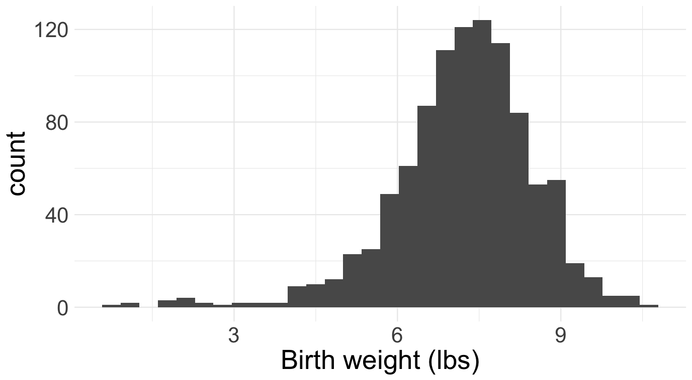
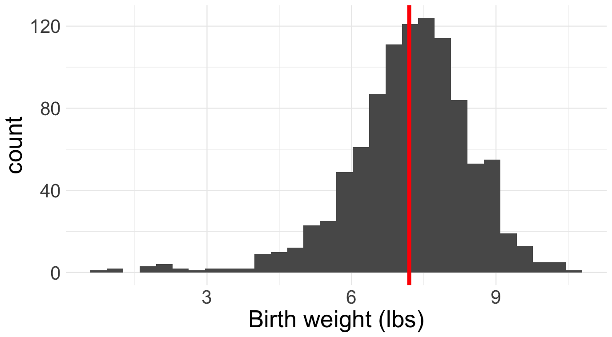
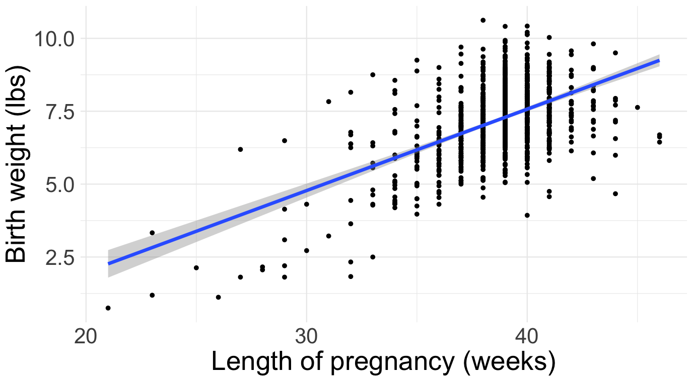
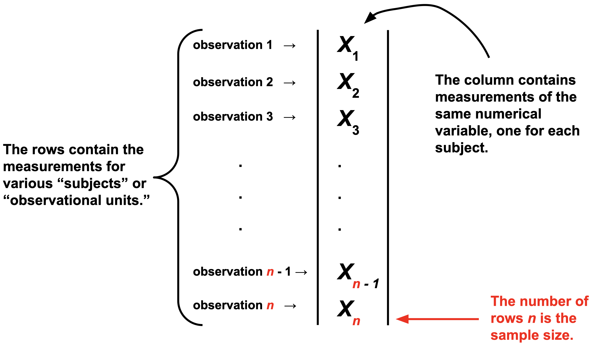

Imagine you work at a hospital. Dozens of babies are delivered in the hospital each week. A lot of information is collected about each birth, and hiding inside of these data is a lot of useful information about the health and future of the community. How can we extract it? If you take classes like STA 101 or 199, you learn various methods:

::: center-table-75
| Question       | Method | Cartoon |
|----------------|------------|--|
| How are birth weights distributed?  | histogram        |  |
| What's the typical birth weight?   | sample average        |   |
| How is birth weight related to gestational age? | linear regression        |   |
: {tbl-colwidths="[40,20,40]"}
:::

In general, the goal of *data science* is to convert data into knowledge, and we perform this "conversion" by applying statistical methods: histogram, sample average, line of best fit, etc. A *mathematical statistician* looks at these methods and wonders: do they actually work? Do they behave the way we expect? Do they deliver what they promise? Are they reliable? How reliable? Under what conditions? And before we can answer these questions, we have to back up and ask a more fundamental one: what does it even *mean* for a statistical method to "work"? These are all theoretical questions, and mathematical statisticians answer them using the tools of probability theory that we have studied for the last twelve weeks. 

# Baby's first dataset

For us, a data set will be a spreadsheet with one column of numbers:

{fig-align="center"}

Of course, in the modern era, datasets are huge. There could be millions of columns. There could be so many columns and rows that you can't fit the entire dataset on a single computer (so-called "big data"). Furthermore, modern datasets are weird. It's not just a box of numbers anymore. Text is data. Images are data. Video is data. Sometimes all at once.

If you continue studying statistics, you'll get there eventually. But for now, let's keep it simple.


# The implicit assumption of all statistics

> Obsered data are the result of a random process. 

By the time the data arrive in our spreadsheet, they are a fixed set of numbers. But how did those numbers get there in the first place? Plenty of seemingly random forces might have had their way before you ever got to observe anything:

- (**nature's randomness**) many of the phenomena we study have an intrinsic random component that is simply irreducible. Think mutations during DNA replication, the quantum behavior of subatomic particles, or the "random walk" in stock prices;
- (**human error**) data are collected by humans, and humans make mistakes;
- (**measurement error**) the laboratory devices we use to collect measurements in the sciences are far from perfect;
- (**study design**) the gold standard for teasing out cause and effect is the randomized controlled trial (RCT) where, *by design*, the researcher randomly divides subjects into treatment and control groups;
- (**survey non-response**) much of our economic data on unemployment, inflation, and the behavior of firms is collected by survey. Political polls are a type of survey. Course evaluations are a survey. Say you issue a survey to a population of interest, and only 10% of respond? Who are they? Why did they respond? Why did the other 90% abstain? There's a lot of randomness going on here, and you need to get your arms around it if you want to interpret the survey results correctly. 

For all of these reasons and more, it is sensible to regard the numbers in our spreadsheet as the end-result of a complex random process. One of the statistician's goals is to model this process and explain how the data turned out the way they did. Part of this job involves modeling the true underlying science, and another part involves modeling the errors introduced in the measurement process. Tricky stuff!

# Classical statistical inference

Since the data in our spreadsheet are the result of a random process, we model them on the blackboard as realizations of *random variables*. Y'know, those things we've been studying for two months. To keep it simple, on a first pass we model the data as **independent and identically distributed** (**iid**) from some shared distribution $P$:

$$
X_1,\,X_2,\,X_3,\,...,\,X_{n-1},\,X_n\overset{\text{iid}}{\sim}P.
$$

If you keep studying statistics, you learn how to relax the iid assumption, which is often bogus. 

The main idea of statistics is that we have no clue what the distribution $P$ is that governs the data. All we have access to are realizations of the $X_i$, and we need to use these to try to reverse engineer $P$. Contrast this with probability. When we were doing probability, $P$ was always known. Every problem thus far has begun with a statement that is equivalent to: "Assume $P$ is..." You were *told* what the distribution was, and then you did some math that reasoned from that assumption to a conclusion about the behavior of $X$: its mean, median, variance, mgf, how to sample it, etc. In statistics, the situation is exactly reversed: given examples of data generated from $P$, can you figure out what $P$ is? As I warned you on the [first day of class](/slides/2025-08-25-welcome.html#/inverse-problems-are-tricky), this task is much less straightforward than probability, so gird your loins!


## Parametric statistics

In principle, $P$ could be literally any probability distribution under the sun. That makes searching for the right one quite daunting. To simplify life, we often make the *extra* assumption that the unknown $P$ belongs to some convenient **parametric family** of distributions, such as the binomial, Poisson, normal, etc: 


$$
X_1,\,X_2,\,X_3,\,...,\,X_{n-1},\,X_n\overset{\text{iid}}{\sim}f_{\theta}.
$$

Here, $f$ is generic notation for *either* a PMF or PDF, and $\theta$ is generic notation for the *finite* set of parameters that govern the distribution. Here are some of the examples we have seen:

- The Bernoulli family has the probability of success $\theta=p$;
- The Poisson family has the rate $\theta=\lambda$;
- The normal family has the mean and variance $\theta=(\mu,\,\sigma^2)$;
- The gamma family has the shape and rate $\theta=(\alpha,\,\beta)$.

If you're willing to swallow the parametric assumption, the goal of statistical inference becomes "use the data to learn the value of the unknown parameter $\theta$." As soon as you know the parameters, you know the entire distribution. Furthermore, statisticians want to *quantify uncertainty* about what we've learned from the data, not just produce a good guess and call it a day.


To be clear from the very outset, the "true" data-generating distribution is seldom if ever literally a member of one of our special parametric families, but as a simplifying assumption, this leap of faith may be "close enough" for practical purposes. If you remain skeptical, I encourage you to dive into the beautiful area of [*nonparametric* statistics](https://doi.org/10.1007/0-387-30623-4) where we do *not* make strong (and often unrealistic) parametric assumptions about $P$. 

## Three's Company

The Catholics have the Father, the Son, and the Holy Spirit. American government has legislative, judicial, and executive branches. Music has melody, harmony, and rhythm. Similarly, we organize classical parametric statistical theory into three related areas of inquiry:

1. (**point estimation**) what is our single number best guess at the unknown parameter?
2. (**interval estimation**) what is a range of likely values for the unknown parameter?
3. (**hypothesis testing**) can the data distinguish between competing claims about the unknown parameter? 

With the short time we have left, we will discuss the first two and defer the third to STA 332. Hypothesis testing turns out to be a surprisingly controversial topic. Spicy!


# Point estimation


$$
X_1,\,X_2,\,X_3,\,...,\,X_{n-1},\,X_n\overset{\text{iid}}{\sim}f_{\theta}.
$$


::: callout-note 
## Definition: estimator

An **estimator** is a rule that takes in data and outputs a best guess at some quantity of interest. Formally, an estimator could be any transformation of the observations:

$$
\hat{\theta}_n=\hat{\theta}(X_1,\,X_2,\,...,\,X_n).
$$

So, in go data, out pops a guess. The notation is deliberate. Our generic notation for the **estimand** (the true but unknown quantity we seek to estimate) will be $\theta$, so $\hat{\theta}$ will be our generic notation for an estimator that targets that quantity. The subscript-$n$ reminds us what sample size our estimate is based on, which will be an important consideration.

:::


The main idea of *classical* statistics is that, since the data are random variables and the estimator is a function of the data, the estimator is a random variable as well. So it has its own distribution which we call the **sampling distribution** of the estimator. If we want to understand how the estimator behaves and whether or not it is "good," we need to understand the properties of its sampling distribution. For example:

- (**bias**) is the estimator correct *on average*? Is the sampling distribution centered on the true value? In other words, do we have $E(\hat{\theta}_n)=\theta$?
- (**variance**) is the estimator stable or volatile? Is the sampling distribution widely spread out or tightly concentrated? In other words, how big is $\text{var}(\hat{\theta}_n)$?
- (**consistency**) As we collect more and more data, does the estimator get closer and closer to the truth? That is, does $\hat{\theta}_n\to\theta$ as $n\to\infty$? If not, then what the hell are we even doing? If so, how fast is the convergence?

To investigate these properties, we need all of the tools of probability theory that we've been developing this semester.

## Measuring the quality of an estimator

In the crudest possible terms, an estimator $\hat{\theta}_n$ is good if it is close to the true value of the unknown parameter $\theta$. To assess this, we choose a **loss function** $L(\hat{\theta}_n,\,\theta)$ that measures the discrepancy between the estimator and the truth. Examples include:

$$
\begin{aligned}
L(\hat{\theta}_n,\,\theta)&=(\hat{\theta}_n-\theta)^2 && \text{squared error loss}\\
L(\hat{\theta}_n,\,\theta)&=|\hat{\theta}_n-\theta| && \text{absolute error}\\
L(\hat{\theta}_n,\,\theta)&=\begin{cases}
0 & \hat{\theta}_n\neq\theta
\\
1 & \hat{\theta}_n=\theta
\end{cases} && \text{zero-one loss}.
\end{aligned}
$$

And trust me, there are more where that come from. I want to emphasize that the loss function is a *choice* made by the statistician to capture their priorities in the analysis. For example, both absolute and squared error loss are symmetric, meaning they penalize over- and under-estimation equally. But if you are working in an environment where one type of error is more costly, you should choose a different loss function that captures that asymmetry. 

Anyhow, the first thing to notice is that the loss of an estimator is just a particular transformation of the estimator. Since the estimator is a random variable, the loss is a random variable as well. If we wish to compute a single number that summarizes *typically* how far the estimator is from the target, we look at the expected value of the loss, which gets a special name:


::: callout-note 
## Definition: risk of an estimator

The **risk** of an estimator is the expected value of the loss:

$$
R(\hat{\theta}_n,\,\theta) = E[L(\hat{\theta}_n,\,\theta)]
$$

The expected value is taken with respect to the sampling distribution of the estimator $\hat{\theta}_n$, and the true but unknown value of the parameter $\theta$ is everywhere treated as a constant.
:::


## Mean squared error

For the rest of the semester, we will focus on the example of squared error loss, mainly because it is convenient mathematically ($x^2$ is differentiable while $|x|$ is not). The risk associated with this loss gets a special name:

::: callout-note 
## Definition: mean squared error (MSE)

The risk of an estimator under squared error loss is its **mean squared error** (**MSE**):

$$
\text{MSE}(\hat{\theta}_n,\,\theta)
=
E[(\theta-\hat{\theta}_n)^2]
.
$$

:::


It turns out that the mean squared error has a powerful and informative decomposition:


::: callout-tip
## Theorem: bias-variance trade-off

The mean squared error of an estimator can be decomposed into the sum of its squared bias and its variance:

$$
\begin{aligned}
\text{MSE}(\hat{\theta}_n,\,\theta)
=
\text{bias}(\hat{\theta}_n,\,\theta)^2
+
\text{var}(\hat{\theta}_n).
\end{aligned}
$$

Here $\text{bias}(\hat{\theta}_n,\,\theta)=E(\hat{\theta}_n)-\theta$ and $\text{var}(\hat{\theta}_n)=E[(\hat{\theta}_n-E(\hat{\theta}_n))^2]$.

:::

::: {.callout-tip appearance="minimal" collapse="true"}
## Proof

$$
\begin{aligned}
\text{MSE}(\hat{\theta}_n,\,\theta)
&=
E[(\theta-\hat{\theta}_n)^2]
\\
&=
E[(\underbrace{\theta-E(\hat{\theta}_n)}_{\text{keep together}}+\underbrace{E(\hat{\theta}_n)-\hat{\theta}_n}_{\text{keep together}})^2]
&&
\text{add zero}
\\
&=
E\left[\underbrace{(\theta-E(\hat{\theta}_n))^2}_{\text{constant}}+\underbrace{2(\theta-E(\hat{\theta}_n))}_{\text{constant}}\underbrace{(E(\hat{\theta}_n)-\hat{\theta}_n)}_{\text{random}}+\underbrace{(E(\hat{\theta}_n)-\hat{\theta}_n)^2}_{\text{random}}\right]
&&
\text{FOIL}
\\
&=
(\theta-E(\hat{\theta}_n))^2+
2(\theta-E(\hat{\theta}_n))
E\left[E(\hat{\theta}_n)-\hat{\theta}_n\right]
+
E[(E(\hat{\theta}_n)-\hat{\theta}_n)^2]
&&
\text{linearity}
\\
&=
(\theta-E(\hat{\theta}_n))^2+
2(\theta-E(\hat{\theta}_n))
\left[E(\hat{\theta}_n)-E(\hat{\theta}_n)\right]
+
E[(E(\hat{\theta}_n)-\hat{\theta}_n)^2]
&&
\text{linearity again}
\\
&=
(\theta-E(\hat{\theta}_n))^2
+
\underbrace{
2(\theta-E(\hat{\theta}_n))
\cdot
0
}_{=0}
+
E[(E(\hat{\theta}_n)-\hat{\theta}_n)^2]
\\
&=
(\theta-E(\hat{\theta}_n))^2
+
E[(E(\hat{\theta}_n)-\hat{\theta}_n)^2]
\\
&=
\text{bias}(\hat{\theta}_n,\,\theta)^2
+
\text{var}(\hat{\theta}_n).
\end{aligned}
$$
:::

Bias refers to how accurate the estimator is on average. If the estimator is "correct" on average and $E(\hat{\theta}_n)=\theta$, then $\text{bias}(\hat{\theta}_n,\,\theta)=0$ and we call the estimator **unbiased**. This would seem to be a good property in and of itself, but if our goal is for *overall* MSE to be as low as possible, the above result shows us that bias is only a part of the story. We must also consider the variance of the estimator. If bias is like the "accuracy" of an estimator and its variance is like the inverse of its precision, then then lesson of the bias-variance decomposition is illustrated with the classic bullseye analogy displayed in @fig-bullseye.


{#fig-bullseye fig-align="center" width="60%"}

The result in this section is referred to as the bias-variance *tradeoff* because in practice, we will sometimes find ourselves tolerating a little bit of bias for a reduction in variance that makes the overall MSE smaller than if we had restricted ourselves to purely unbiased estimators. This opens up a whole kettle of worms involving topics like **shrinkage** and **regularization**. Fun stuff for another day!

::: callout-note
## Definition: consistency

If $\text{MSE}(\hat{\theta}_n,\,\theta)\to 0$ as $n\to\infty$, then we say that an estimator is **consistent**. In order to be consistent, an estimators bias and variance must both go to zero as the sample size increases. If the estimator is already unbiased, then consistency is guaranteed if the variance goes to 0. 

:::

When it comes to point estimation, this is the ultimate sanity check. If we had *infinite* data, would our estimator recover the truth? If the answer is no, then wut wut wut are we doing? An estimator should *at least* be consistent. But if the answer is yes, this isn't the slam dunk it may seen like. Consistency is an *asymptotic* property. It tells us what happens if we have infinite data. But we never actually have infinite data. We have a finite set of observations. If an estimator is consistent but the rate of convergence is very slow, then that somewhat curbs our enthusiasm for it.


# Interval estimation

If I had to boil statistics down to the one main idea that distinguishes it from adjacent fields, I would say that statistics is uniquely focused on the quantification of uncertainty to help make decisions. As such, we are not content to simply construct a single number best guess for an unknown quantity. We also want to construct a range that communicates uncertainty. If the data give us a wide range, then uncertainty is high. If the data give us a small range, then uncertainty is low. At the crudest level of abstraction, that's basically it.


# Example: Bernoulli data (coin flip)

To illustrate the concepts introduced above, let us consider the simplest possible inference problem. Imagine we have *binary* data:

$$
X_i
=
\begin{cases}
1 & \text{something happened}\\
0 & \text{something didn't happen.}
\end{cases}
$$

Assuming the $X_i$ are independent and identically distributed (iid), there is really only one distribution that could have generated these data:

$$
X_1,\,X_2,\,X_3,\,...,\,X_{n-1},\,X_n\overset{\text{iid}}{\sim}\text{Bernoulli}(\theta).
$$

This becomes a statistics problem when we imagine that the probability of success $\theta=P(X_1=1)$ is unknown. This serves as a model for the archetypal statistics problem that we discussed in our [first lecture](/slides/2025-08-25-welcome.html#/an-archetypal-statistics-problem): given a mystery coin with an unknown probability of heads $0\leq\theta\leq 1$, you flip the coin $n$ times and use the outcomes $X_i$ to guess what the underlying probability is. The goal of statistics is to use the data to learn what $\theta$ is *and also* to quantify our uncertainty about it. In other words, we want to construct an estimator and a confidence interval for $\theta$ that have good statistical properties.

## Point estimation

So, where do you even start? Confronted with a new statistical problem, how do you devise a reasonable estimator? In upcoming lectures we will study a generic principle (maximum likelihood) that automatically guides you to a reasonable starting point. But for now, let's just go off vibes. The unknown parameter $0\leq \theta\leq 1$ is a probability representing the likelihood of an event occurring. Our dataset of binary variables $X_1$, $X_2$, ..., $X_n$ is essentially a running tally of how often we actually observed the event of interest (eg the coin coming up heads), and so a reasonable estimator might be the proportion of successes that we observed:

$$
\hat{\theta}_n=\begin{matrix}\text{sample}\\\text{proportion}\end{matrix}=\frac{\#(X_i=1)}{n}=\frac{1}{n}\sum\limits_{i=1}^nX_i.
$$

Again, we will have firmer motivations for this choice later, but things are already looking promising. Why? Because this choice of estimator takes the form of an *average* of iid random variables, and we know a lot about how those behave.

To begin, recall some facts about the [Bernoulli distribution](/distributions/discrete-binomial.html):

$$
\begin{aligned}
E(X_1)&=\theta\\
\text{var}(X_1)&=\theta(1-\theta).
\end{aligned}
$$

Since $X_i\overset{\text{iid}}{\sim}\text{Bernoulli}(\theta)$ and $\hat{\theta}_n$ is their average, we know from [before](/lecture-notes/sta240-notes-14-sums-and-averages.pdf) that 

$$
\begin{aligned}
E(\hat{\theta}_n)&=\theta\\
\text{var}(\hat{\theta}_n)&=\frac{\theta(1-\theta)}{n}.
\end{aligned}
$$


```{shinylive-r}
#| standalone: true
#| viewerHeight: 500

library(shiny)

ui <- fluidPage(
  titlePanel("Sampling distribution of the sample proportion"),
  
  sidebarLayout(
    sidebarPanel(
      sliderInput("n", "Sample size (n):", min = 1, max = 200, value = 1, step = 1),
      sliderInput("p", "True probability of success (θ):", min = 0, max = 1, value = 0.5, step = 0.01)
    ),
    
    mainPanel(
      plotOutput("distPlot")
    )
  )
)

server <- function(input, output, session) {
  
  output$distPlot <- renderPlot({
    n <- input$n
    p <- input$p
    
    plot((0:n) / n, dbinom(0:n, n, p), type = "h",
         xlab = expression(bar(x)),
         ylab = expression("P(" ~ bar(X)[n] ~ " = " ~ bar(x) ~ ")"),
         main = expression("Average of iid" ~ X[i] ~ "~ Bernoulli(θ)"))
    
    mtext("θ", side = 1, at = p, col = "red", line = 2)
  })
}

shinyApp(ui, server)


```

## Interval estimation


### Review: standard normal quantiles

Let $Z\sim\text{N}(0,\,1)$. This means that 


$$
\begin{aligned}
f_Z(z)&=\frac{1}{\sqrt{2\pi}}\exp\left(-\frac{1}{2}z^2\right), && -\infty<z<\infty\\
F_Z(t)&=P(Z\leq z)\\
&=\frac{1}{\sqrt{2\pi}}\int_{-\infty}^z\exp\left(-\frac{1}{2}t^2\right), && -\infty<z<\infty.
\end{aligned}
$$

Use $z(p)=F_Z^{-1}(p)$ to denote the quantile function (ie the inverse cdf) of the standard normal. Some of its values are kinda famous: $z(1/2)=0$, $z(0.95)\approx 1.645$, $z(0.975)\approx 1.96$, etc. For $p>1/2$, $z(p)>0$, and so by symmetry of the bell curve about zero,

$$
\begin{aligned}
P\left(-z(p)<Z<z(p)\right)
&=
F_Z(z(p))-F_Z(-z(p))
\\
&=
F_Z(z(p))-[1-F_Z(z(p))]
\\
&=
F_Z(F_Z^{-1}(p))-[1-F_Z(F_Z^{-1}(p))]
\\
&=
p-(1-p)
\\
&=
2p-1
.
\end{aligned}
$$

Here's the picture:

```{r}
#| echo: false

zp <- 1.5

curve(dnorm(x), from = -4, to = 4, n = 1000, bty = "n", yaxt = "n", ylab = "", xaxt = "n", xlab = "", yaxs = "i", col = "blue")
axis(1, at = c(-4, -zp, 0, zp, 4), labels = c(NA, "-z(p)", "0", "z(p)", NA))
abline(v = c(-zp, zp), lty = 2)
text(0, dnorm(0) / 2, "2p - 1")
text(1.2 * zp, dnorm(1.2 * zp) / 2, "1 - p")
text(-1.2 * zp, dnorm(1.2 * zp) / 2, "1 - p")
```

So, if we have $\alpha>1/2$, and we seek lower and upper bounds that swallow the middle $1-\alpha$ of the density and place $\alpha/2$ in either tail, we can take $\pm z(1-\alpha/2)$, because 

$$
2(1-\alpha/2)-1=2-\alpha+1=1-\alpha,
$$

and so $P(-z(1-\alpha/2) < Z < z(1-\alpha/2))=1-\alpha$. Again:

```{r}
#| echo: false

zp <- 1.5

curve(dnorm(x), from = -4, to = 4, n = 1000, bty = "n", yaxt = "n", ylab = "", xaxt = "n", xlab = "", yaxs = "i", col = "blue")
axis(1, at = c(-4, -zp, 0, zp, 4), labels = c(NA, "-z(1 - α/2)", "0", "z(1 - α/2)", NA))
abline(v = c(-zp, zp), lty = 2)
text(0, dnorm(0) / 2, "1 - α")
text(1.2 * zp, dnorm(1.2 * zp) / 2, "α / 2")
text(-1.2 * zp, dnorm(1.2 * zp) / 2, "α / 2")
```


### Large sample confidence interval

Since our estimator $\hat{\theta}_n$ is the average of iid random variables $X_i$ with finite mean $\theta$ and variance $\theta(1-\theta)$, the [central limit theorem](/lecture-notes/sta240-notes-16-clt.html) guarantees that 

$$
\frac{\hat{\theta}_n-\theta}{\sqrt{\theta(1-\theta)/n}}\overset{d}{\to}\text{N}(0,\,1).
$$

Furthermore, if you take a class like STA 332, you learn that this remains true if you replace the true but unknown $\theta$ in the denominator with the estimator. So

$$
\frac{\hat{\theta}_n-\theta}{\sqrt{\hat{\theta}_n(1-\hat{\theta}_n)/n}}\overset{d}{\to}\text{N}(0,\,1).
$$

Note that this is *not* what the central limit theorem says off the shelf. This is a new result that you have to work to prove. But for now we will take it for granted and use it to derive an approximate confidence interval for $\theta$.

Practically speaking, these results give us permission to use N(0, 1) to approximate the distribution of the random variable on the left, provided $n$ is sufficiently large that the theorem has "kicked in." If the approximation is good, it means that we can use the results from the previous section to say that:

$$
P\left(-z\left(1-\frac{\alpha}{2}\right)<\frac{\hat{\theta}_n-\theta}{\sqrt{\hat{\theta}_n(1-\hat{\theta}_n)/n}}<z\left(1-\frac{\alpha}{2}\right)\right)\approx 1 - \alpha,\quad \alpha>1/2.
$$

By doing some itchy algebra, we can rewrite this statement in the form $P(L_n<\theta<U_n)\approx 1-\alpha$, which is exactly what we want for a confidence interval:

$$
\begin{aligned}
1-\alpha
&\approx
P\left(-z\left(1-\frac{\alpha}{2}\right)<\frac{\hat{\theta}_n-\theta}{\sqrt{\hat{\theta}_n(1-\hat{\theta}_n)/n}}<z\left(1-\frac{\alpha}{2}\right)\right)
\\
&=
P\left(-z\left(1-\frac{\alpha}{2}\right)\sqrt{\frac{\hat{\theta}_n(1-\hat{\theta}_n)}{n}}<\hat{\theta}_n-\theta<z\left(1-\frac{\alpha}{2}\right)\sqrt{\frac{\hat{\theta}_n(1-\hat{\theta}_n)}{n}}\right)
\\
&=
P\left(-\hat{\theta}_n-z\left(1-\frac{\alpha}{2}\right)\sqrt{\frac{\hat{\theta}_n(1-\hat{\theta}_n)}{n}}<-\theta<-\hat{\theta}_n+z\left(1-\frac{\alpha}{2}\right)\sqrt{\frac{\hat{\theta}_n(1-\hat{\theta}_n)}{n}}\right)
\\
&=
P\left(\hat{\theta}_n+z\left(1-\frac{\alpha}{2}\right)\sqrt{\frac{\hat{\theta}_n(1-\hat{\theta}_n)}{n}}>\theta>\hat{\theta}_n-z\left(1-\frac{\alpha}{2}\right)\sqrt{\frac{\hat{\theta}_n(1-\hat{\theta}_n)}{n}}\right)
\\
&=
P\left(\hat{\theta}_n-z\left(1-\frac{\alpha}{2}\right)\sqrt{\frac{\hat{\theta}_n(1-\hat{\theta}_n)}{n}}<\theta<\hat{\theta}_n+z\left(1-\frac{\alpha}{2}\right)\sqrt{\frac{\hat{\theta}_n(1-\hat{\theta}_n)}{n}}\right)
.
\end{aligned}
$$

So, if we take $L_n=\hat{\theta}_n-z\left(1-\frac{\alpha}{2}\right)\sqrt{\frac{\hat{\theta}_n(1-\hat{\theta}_n)}{n}}$ and $U_n=\hat{\theta}_n+z\left(1-\frac{\alpha}{2}\right)\sqrt{\frac{\hat{\theta}_n(1-\hat{\theta}_n)}{n}}$, we get an interval satisfying $P(L_n<\theta<U_n)\approx 1-\alpha$ for sufficiently large $n$.


