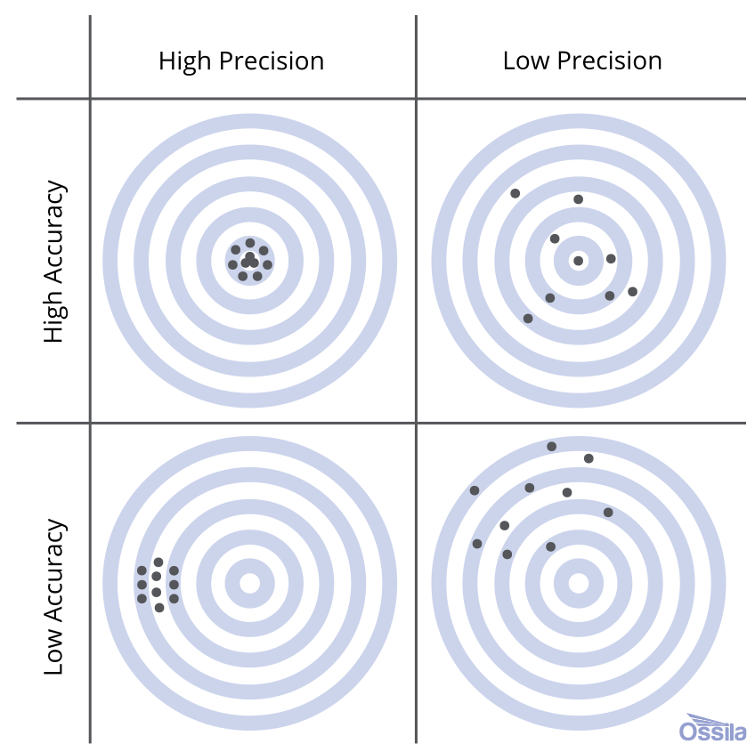

Imagine you work at a hospital. Dozens of babies are delivered in the hospital each week. A lot of information is collected about each birth, and hiding inside of these data is a lot of useful information about the health and future of the community. How can we extract it? If you take classes like STA 101 or 199, you learn various methods:

::: {.center-table}
| Question       | Method | Cartoon |
|----------------|------------|--|
| How are birth weights distributed?  | histogram        |  |
| What's the typical birth weight?   | sample average        | |
| How is birth weight related to gestational age? | linear regression        | |
:::

In general, the goal of *data science* is to convert data into knowledge, and we perform this "conversion" by applying statistical methods: histogram, sample average, line of best fit, etc. A *mathematical statistician* looks at these methods and wonders: do they actually work? Do they behave the way we expect? Do they deliver what they promise? Are they reliable? How reliable? Under what conditions? And before we can answer these questions, we have to back up and ask a more fundamental one: what does it even *mean* for a statistical method to "work"? These are all theoretical questions, and mathematical statisticians answer them using the tools of probability theory that we have studied for the last twelve weeks. 

# Baby's first dataset

For us, a data set will be a spreadsheet with one column of numbers:

XXX

Of course, in the modern era, datasets are huge. There could be millions of columns. There could be so many columns and rows that you can't fit the entire dataset on a single computer (so-called "big data"). Furthermore, modern datasets are weird. It's not just a box of numbers anymore. Text is data. Images are data. Video is data. Sometimes all at once.

If you continue studying statistics, you'll get there eventually. But for now, let's keep it simple.

# The implicit assumption of all statistics

> Obsered data are the result of a random process. 

By the time the data arrive in our spreadsheet, they are a fixed set of numbers. But how did those numbers get there in the first place? Plenty of seemingly random forces might have had their way before you ever got to observe anything:

- (**nature's randomness**) many of the phenomena we study have an intrinsic random component that is simply irreducible. Think mutations during DNA replication, the quantum behavior of subatomic particles, or the "random walk" in stock prices;
- (**human error**) data are collected by humans, and humans make mistakes;
- (**measurement error**) the laboratory devices we use to collect measurements in the sciences are far from perfect;
- (**study design**) the gold standard for teasing out cause and effect is the randomized controlled trial (RCT) where, *by design*, the researcher randomly divides subjects into treatment and control groups;
- (**survey non-response**) much of our economic data on unemployment, inflation, and the behavior of firms is collected by survey. Political polls are a type of survey. Course evaluations are a survey. Say you issue a survey to a population of interest, and only 10% of respond? Who are they? Why did they respond? Why did the other 90% abstain? There's a lot of randomness going on here, and you need to get your arms around it if you want to interpret the survey results correctly. 

For all of these reasons and more, it is sensible to regard the numbers in our spreadsheet as the end-result of a complex random process. One of the statistician's goals is to model this process and explain how the data turned out the way they did. Part of this job involves modeling the true underlying science, and another part involves modeling the errors introduced in the measurement process. Tricky stuff!

# Classical statistical inference

Since the data in our spreadsheet are the result of a random process, we model them on the blackboard as realizations of *random variables*. Y'know, those things we've been studying for two months. To keep it simple, on a first pass we model the data as **independent and identically distributed** (**iid**) from some shared distribution $P$:

$$
X_1,\,X_2,\,X_3,\,...,\,X_{n-1},\,X_n\overset{\text{iid}}{\sim}P.
$$

If you keep studying statistics, you learn how to relax the iid assumption, which is often bogus. 

The main idea of statistics is that we have no clue what the distribution $P$ is that governs the data. All we have access to are realizations of the $X_i$, and we need to use these to try to reverse engineer $P$. Contrast this with probability. When we were doing probability, $P$ was always known. Every problem thus far has begun with a statement that is equivalent to: "Assume $P$ is..." You were *told* what the distribution was, and then you did some math that reasoned from that assumption to a conclusion about the behavior of $X$. In statistics, the situation is exactly reversed: given examples of data generated from $P$, can you figure out what $P$ is? As I warned you on the [first day of class](/slides/2025-08-25-welcome.html#/inverse-problems-are-tricky), this task is much less straightforward than probability, so gird your loins!

## Parametric statistics

In principle, $P$ could be literally any probability distribution under the sun. That makes searching for the right one quite daunting. To simplify life, we often make the *extra* assumption that the unknown $P$ belongs to some convenient **parametric family** of distributions, such as the binomial, Poisson, normal, etc. 

$$
X_1,\,X_2,\,X_3,\,...,\,X_{n-1},\,X_n\overset{\text{iid}}{\sim}f_{\theta}.
$$

Here, $f$ is generic notation for *either* a PMF or PDF. 

## Three's Company

The Catholics have the Father, the Son, and the Holy Spirit. American government has legislative, judicial, and executive branches. Music has melody, harmony, and rhythm. Similarly, we organize classical statistical theory into three related areas of inquiry:

1. (**point estimation**) what is our single number best guess at the unknown parameter?
2. (**interval estimation**) what is a range of likely values for the unknown parameter?
3. (**hypothesis testing**) can the data distinguish between competing claims about the unknown parameter? 

With the short time we have left, we will discuss the first two and defer the third to STA 332.

# Point estimation

YADA YADA

The main idea of *classical* statistics is that, since the data are random variables and the estimator is a function of the data, the estimator is a random variable as well. So it has its own distribution which we call the **sampling distribution** of the estimator. If we want to understand how the estimator behaves and whether or not it is "good," we need to understand the properties of its sampling distribution: where is it centered? how spread out is it? what happens to it as we collect more and more data ($n\to\infty$)? To answer these questions, we will use all of the tools of probability theory that we've been developing this semester.

## Measuring the quality of an estimator

In the crudest possible terms, an estimator $\hat{\theta}_n$ is good if it is close to the true value of the unknown parameter $\theta$. To assess this, we choose a **loss function** $L(\hat{\theta}_n,\,\theta)$ that measures the discrepancy between the estimator and the truth. Examples include:

$$
\begin{aligned}
L(\hat{\theta}_n,\,\theta)&=(\hat{\theta}_n-\theta)^2 && \text{squared error loss}\\
L(\hat{\theta}_n,\,\theta)&=|\hat{\theta}_n-\theta| && \text{absolute error}\\
L(\hat{\theta}_n,\,\theta)&=\begin{cases}
0 & \hat{\theta}_n\neq\theta
\\
1 & \hat{\theta}_n=\theta
\end{cases} && \text{zero-one loss}.
\end{aligned}
$$

And trust me, there are more where that come from. I want to emphasize that the loss function is a *choice* made by the statistician to capture their priorities in the analysis. For example, both absolute and squared error loss are symmetric, meaning they penalize over- and under-estimation equally. But if you are working in an environment where one type of error is more costly, you should choose a different loss function that captures that asymmetry. 

Anyhow, the first thing to notice is that the loss of an estimator is just a particular transformation of the estimator. Since the estimator is a random variable, the loss is a random variable as well. If we wish to compute a single number that summarizes *typically* how far the estimator is from the target, we look at the expected value of the loss, which gets a special name:

::: callout-note 
## Definition: risk of an estimator

The **risk** of an estimator is the expected value of the loss:

$$
R(\hat{\theta}_n,\,\theta) = E[L(\hat{\theta}_n,\,\theta)]
$$

The expected value is taken with respect to the sampling distribution of the estimator $\hat{\theta}_n$, and the true but unknown value of the parameter $\theta$ is everywhere treated as a constant.
:::

## Mean squared error

For the rest of the semester, we will focus on the example of squared error loss, mainly because it is convenient mathematically ($x^2$ is differentiable while $|x|$ is not). The risk associated with this loss gets a special name:

::: callout-note 
## Definition: mean squared error (MSE)

The risk of an estimator under squared error loss is its **mean squared error** (**MSE**):

$$
\text{MSE}(\hat{\theta}_n,\,\theta)
=
E[(\theta-\hat{\theta}_n)^2]
.
$$

:::

It turns out that the mean squared error has a powerful and informative decomposition:

::: callout-tip
## Theorem: bias-variance trade-off

The mean squared error of an estimator can be decomposed into the sum of its squared bias and its variance:

$$
\begin{aligned}
\text{MSE}(\hat{\theta}_n,\,\theta)
=
\text{bias}(\hat{\theta}_n,\,\theta)^2
+
\text{var}(\hat{\theta}_n).
\end{aligned}
$$

Here $\text{bias}(\hat{\theta}_n,\,\theta)=E(\hat{\theta}_n)-\theta$ and $\text{var}(\hat{\theta}_n)=E[(\hat{\theta}_n-E(\hat{\theta}_n))^2]$.

:::

::: {.callout-tip appearance="minimal" collapse="true"}
## Proof

$$
\begin{aligned}
\text{MSE}(\hat{\theta}_n,\,\theta)
&=
E[(\theta-\hat{\theta}_n)^2]
\\
&=
E[(\underbrace{\theta-E(\hat{\theta}_n)}_{\text{keep together}}+\underbrace{E(\hat{\theta}_n)-\hat{\theta}_n}_{\text{keep together}})^2]
&&
\text{add zero}
\\
&=
E\left[\underbrace{(\theta-E(\hat{\theta}_n))^2}_{\text{constant}}+\underbrace{2(\theta-E(\hat{\theta}_n))}_{\text{constant}}\underbrace{(E(\hat{\theta}_n)-\hat{\theta}_n)}_{\text{random}}+\underbrace{(E(\hat{\theta}_n)-\hat{\theta}_n)^2}_{\text{random}}\right]
&&
\text{FOIL}
\\
&=
(\theta-E(\hat{\theta}_n))^2+
2(\theta-E(\hat{\theta}_n))
E\left[E(\hat{\theta}_n)-\hat{\theta}_n\right]
+
E[(E(\hat{\theta}_n)-\hat{\theta}_n)^2]
&&
\text{linearity}
\\
&=
(\theta-E(\hat{\theta}_n))^2+
2(\theta-E(\hat{\theta}_n))
\left[E(\hat{\theta}_n)-E(\hat{\theta}_n)\right]
+
E[(E(\hat{\theta}_n)-\hat{\theta}_n)^2]
&&
\text{linearity again}
\\
&=
(\theta-E(\hat{\theta}_n))^2+
2(\theta-E(\hat{\theta}_n))
\cdot
0
+
E[(E(\hat{\theta}_n)-\hat{\theta}_n)^2]
\\
&=
(\theta-E(\hat{\theta}_n))^2
+
E[(E(\hat{\theta}_n)-\hat{\theta}_n)^2]
\\
&=
\text{bias}(\hat{\theta}_n,\,\theta)^2
+
\text{var}(\hat{\theta}_n).
\end{aligned}
$$
:::

{#fig-bullseye fig-align="center" width="60%"}

# Interval estimation

# Example: Bernoulli data (coin flip)

# Scraps (will delete)

Statisticians have found that it is convenient to use the tools and language of probability to get a handle on the variation that we observe in real-world data. 

This assumption is so foundational to statistics that it often goes unremarked upon and recedes into the background, but it is indeed an assumption. Not every set of numbers you would seek to extract patterns from is random, but this is the first assumption a statistician makes. 

We use the language and tools of probability to model *variation*. Even if the variation in our datasets is not literally the result of random forces, it may be convenient to proceed *as if* it is. 

