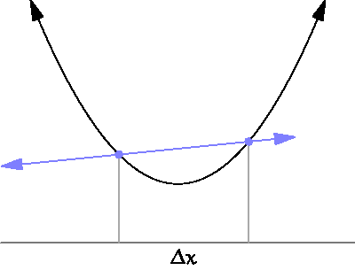

The **derivative** of a function $f(x)$ is its instantaneous rate of change. On a graph, this corresponds to the slope of the tangent line. We will denote derivatives by $f'(x)$ or $\text{d}f/\text{d}x$ or something like that. 

When it exists, **which it doesn't always**, the derivative is defined as the limit of difference quotients:

$$
f'(x)=\lim_{\Delta x\to0}\frac{f(x+\Delta x)-f(x)}{\Delta x}.
$$

So, "rise over run" as the "run" bit gets arbitrarily small.

{fig-align="center"}

As such, the derivative is the continuous analog to a discrete difference.

## Derivative rules 


| rule | function       | derivative |
|------|--------------------|--------------|
| constant    | $h(x)=c$ | $h'(x)=0$        |
| scaling     | $h(x)=c\cdot f(x)$ |  $h'(x)=c\cdot f'(x)$ |
| sum/difference | $h(x)=f(x)\pm g(x)$ | $h'(x)=f'(x)\pm g'(x)$ |
| linearity | $h(x)=a\cdot f(x)\pm b\cdot g(x)$ | $h'(x)=a\cdot f'(x)\pm b\cdot g'(x)$ |
| power | $h(x)=x^n$| $h'(x)=nx^{n-1}$|
| product |$h(x)=f(x)g(x)$| $h'(x)=f'(x)g(x)+f(x)g'(x)$|
| quotient |$h(x)=f(x)/g(x)$| $h'(x)=\frac{f'(x)g(x)+f(x)g'(x)}{g(x)^2}$|
| chain |$h(x)=f(g(x))$| $h'(x)=f'(g(x))g'(x)$|
| exponential |$h(x)=e^x$| $h'(x)=e^x$|
| natural log | $h(x)=\ln(x)$| $h'(x)=1/x$|


## Curvature

If you take the derivative of $f$, you get the **first derivative** $f'$. If you take the derivative of the derivative, you get the **second derivative** $f''$. The derivative of the derivative of the derivative is the **third derivative** $f'''$, and [on and on](https://youtu.be/TW28iWV7nxE?si=EZrdZrENMdE6JvT1). But let's focus on the first two. The derivatives contain information about the shape of the original function:

- the first derivative tells you if the function is increasing or decreasing;
    - if $f'(x)>0$, then $f$ is increasing at $x$;
    - if $f'(x)<0$, then $f$ is decreasing at $x$;
    - if $f'(x)=0$, then $f$ is not changing at $x$;
- if the second derivative tells you about the **curvature** (aka **concavity**) of the function:
    - if $f''(x)>0$, then $f$ is **concave up** ($\cup$, smiling) at $x$;
    - if $f''(x)<0$, then $f$ is **concave down** ($\cap$, frowning) at $x$.
    
Here is an illustration with the function $f(x)=x^3-x$ and its derivatives $f'(x)=3x^2-1$ and $f''(x)=6x$ (power rule!):

```{r}
#| label: fig-derivatives
#| echo: false
#| fig-align: center
#| fig-asp: 1
ticks = seq(-1.5, 1.5, by = 0.5)
labs = c(NA, ticks[-c(1, length(ticks))], NA)
par(mfrow = c(3, 1), mar = c(0, 5, 0, 0.5))
curve(x^3 - x, from = -2, to = 2, 
      xaxt = "n", xaxs = "i", col = "red", 
      yaxt = "n", yaxs = "i",
      lwd = 2, xlim = c(-1.5, 1.5), ylim = c(-1, 1),
      ylab = "original function", 
      panel.first = c(polygon(x = c(-10, 0, 0, -10),
                            y = c(-100, -100, 100, 100),
                            col = rgb(1, 0.5, 0, 0.1),
                            border = NA),
                      polygon(x = c(10, 0, 0, 10),
                            y = c(-100, -100, 100, 100),
                            col = rgb(0, 0, 1, 0.1),
                            border = NA))
      )
legend("topleft", "concave down", text.col = "orange", 
       bty = "n", bg = "transparent", cex = 1.5)
legend("bottomright", "concave up", text.col = "blue", 
       bty = "n", bg = "transparent", cex = 1.5)
box(lwd = 3)
abline(v = c(0, -1/sqrt(3), 1/sqrt(3)), lty = c(1, 2, 2))
axis(1, pos = 0, at = ticks, labels = labs)
curve(3*x^2 - 1, from = -2, to = 2, 
      xaxt = "n", xaxs = "i", col = "red", 
      yaxt = "n", yaxs = "i",
      lwd = 2, , xlim = c(-1.5, 1.5), ylim = c(-2, 4),
      ylab  = "first derivative")
segments(-1/sqrt(3), 0, -1/sqrt(3), 100, lty = 2)
segments(1/sqrt(3), 0, 1/sqrt(3), 100, lty = 2)
axis(1, pos = 0, at = ticks, labels = labs)
points(c(-1/sqrt(3), 1/sqrt(3)), c(0, 0), pch = 19, cex = 2, col = "red")
box(lwd = 3)
abline(v = 0)
curve(6*x, from = -2, to = 2, 
      xaxt = "n", xaxs = "i", col = "red", 
      yaxt = "n", yaxs = "i",
      lwd = 2, , xlim = c(-1.5, 1.5),
      ylab = "second derivative",
            panel.first = c(polygon(x = c(-10, 0, 0, -10),
                            y = c(-100, -100, 100, 100),
                            col = rgb(1, 0.5, 0, 0.1),
                            border = NA),
                      polygon(x = c(10, 0, 0, 10),
                            y = c(-100, -100, 100, 100),
                            col = rgb(0, 0, 1, 0.1),
                            border = NA)))
box(lwd = 3)
abline(v = 0)
axis(1, pos = 0, at = ticks, labels = labs)
points(0, 0, pch = 19, col = "red", cex = 2)
```

When the first derivative changes sign (at $x=\pm1/\sqrt{3}$), that corresponds to the original function switching from increasing to decreasing, or vice versa. When the second derivative changes sign (at $x=0$), that corresponds to the original function switching from concave down (frowning) to concave up (smiling). 

A point like $x=0$ in this example where the concavity changes is called an **inflection point**. If $x_0$ is an inflection point, then that means it's also a root of the second derivative: $f''(x_0)=0$. In order for the second derivative to change sign, it has to cross the $x$-axis. 

## Optimization

When we study the topic of maximum likelihood estimation (MLE), we will have to do some optimization. That is, given an **objective function** $f$, we seek to find the $x$-values at which $f$ has a maximum:

$$
\underset{x\in\mathbb{R}}{\arg\max}\,f(x).
$$

Notice that I did not write $\max f(x)$. In this class, it turns out that we will seldom care about the actual largest value that the function obtains. Instead, we care only for *where* that value occurs. So we are interested in the *location* of the maximum. We are interested in the $x$-value *that does* the maximizing. Hence, argmax and not max. Here's an illustration:

```{r}
#| echo: false
par(mar = c(2, 6, 1, 0))
curve(-(x-3)^2 + 5, from = 0, to = 6, ylim = c(-4, 6),
      xaxt = "n", yaxt = "n", bty = "n", ylab = "",
      col = "red", lwd = 3,
      panel.first = c(segments(3, -4, 3, 5, lty = 2, col = "pink", lwd = 2),
                      segments(0, 5, 3, 5, lty = 2, col = "pink", lwd = 2)))
axis(1, pos = 0)
axis(2, pos = 0)
mtext("max f(x)", side = 2, at = 5, las = 1, line = 1, col = "blue")
mtext("argmax f(x)", side = 1, at = 3, col = "blue")
```

Inspecting this picture, we notice that the maximum corresponds to a point where the derivative (slope of the tangent line) is zero. So to optimize $f$, we can compute its first derivative, set it equal to 0, and solve.

A point like blah in this example is called a **critical point**. A critical point *may* be the location of an optimum, but you have to check. If you recall the example in @fig-derivatives, there are two critical points $x^\star = \pm 1/sqrt{3}$, but they correspond to different things: one is a minimum and one is a maximum. In order to classify the critical points as maximizers or minimizers, you perform the **second derivative test**: 

- 
- 
- 

::: callout-tip
## Example
:::


