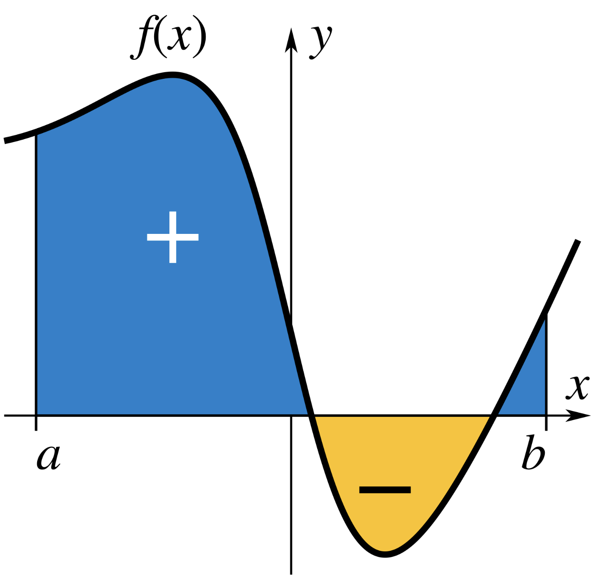
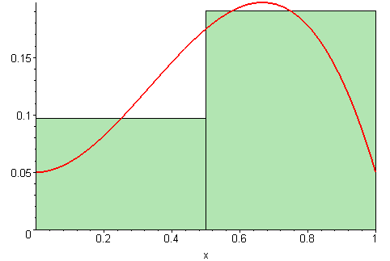

Crudely, the **definite integral** of a function gives you the (signed) area between the graph of the function and the $x$-axis. 

{fig-align="center" width="40%"}

When it exists, which it doesn't always, the definite integral can be defined as the limit of Riemann sums:

$$
\int_a^b f(x)\,\text{d}x=\lim_{\Delta x\to 0}\sum\limits_{i=1}^n f(x_i^*)\Delta x.
$$

Just as the [derivative](https://sta240-f25.github.io/math/differentiation.html) is the continuous analog to a discrete difference, the integral is the continuous analog to a discrete sum. 

{fig-align="center"}

## The fundamental theorem of calculus

The **fundamental theorem of calculus** is a bridge between the seemingly unrelated worlds of derivatives and integrals:

$$
\int_a^bf(x)\,\text{d}x=F(b)-F(a),\quad f(x)=F'(x).
$$

On a practical level, it provides a route for evaluating definite integrals by **antidifferentiation**. The function you are trying to integrate (called the **integrand**) is $f$. You imagine $f$ is the derivative of some function $F$ which you don't yet know. If you can "undo" the differentiation and figure out what $F$ is, then you can evaluate the integral. 

::: callout-tip
## Example: antidifferentiation

Consider 
$$
\int_1^2\frac{1}{x^2}\,\text{d}x.
$$
What function, when you take its derivative, gives you $1/x^2=x^{-2}$? To answer that, you're essentially *undoing* the [power rule](https://sta240-f25.github.io/math/differentiation.html#derivative-rules). After a while, you realize
$$
\frac{\text{d}}{\text{d}x}\left(-\frac{1}{x}\right)=\frac{1}{x^2},
$$
and so 

$$
\int_1^2\frac{1}{x^2}\,\text{d}x=\left[-\frac{1}{x}\right]_1^2=-\frac{1}{2}-\left(-\frac{1}{1}\right)=\frac{1}{2}.
$$

:::

## Integration by substitution

When you perform a **$u$-substitution**, you're basically trying to undo the chain rule. The goal is to rewrite the integral in a nicer form so that you can recognize what the appropriate antiderivative is and then apply the FTOC. 

::: callout-tip 
## Example: $u$-sub
:::

## Integration by parts

Let's face it; this sucks. But sometimes there's no way around it. 

$$
\int_a^b u(x) v'(x) \, \text{d}x 
    = \left[u(x) v(x)\right]_a^b - \int_a^b u'(x) v(x) \, \text{d}x
$$

::: callout-tip 
## Example: IBP

Consider this integral:

$$
\int_1^2\frac{\ln(x)}{x^2}\text{d}x
$$
$\ln(x)$ is easier to differentiate, and $1/x^2$ is easier to antidifferentiate, which suggests the following choice:

$$
\begin{aligned}
u&=\ln(x)\\
\text{d}u&=\frac{\text{d}x}{x}\\
v&=-x^{-1}\\
\text{d}v&=x^{-2}.
\end{aligned}
$$

Let the fun begin:

$$
\begin{aligned}
\int_1^2\frac{\ln(x)}{x^2}\text{d}x
&=
\left[-\frac{\ln(x)}{x}\right]_1^2
+
\int_1^2\frac{\text{d}x}{x^2}
\\
&=
\left[-\frac{\ln(x)}{x}\right]_1^2
+
\left[-x^{-1}\right]_1^2
\\
&=
\left[-\frac{\ln(2)}{2}-\left(-\frac{\ln(1)}{1}\right)\right]
+
\left[-\frac{1}{2}-\left(-\frac{1}{1}\right)\right]
\\
&=
-\frac{\ln(2)}{2} + \frac{1}{2}.
\end{aligned}
$$
:::

## Improper integration (we will do this a lot!)

