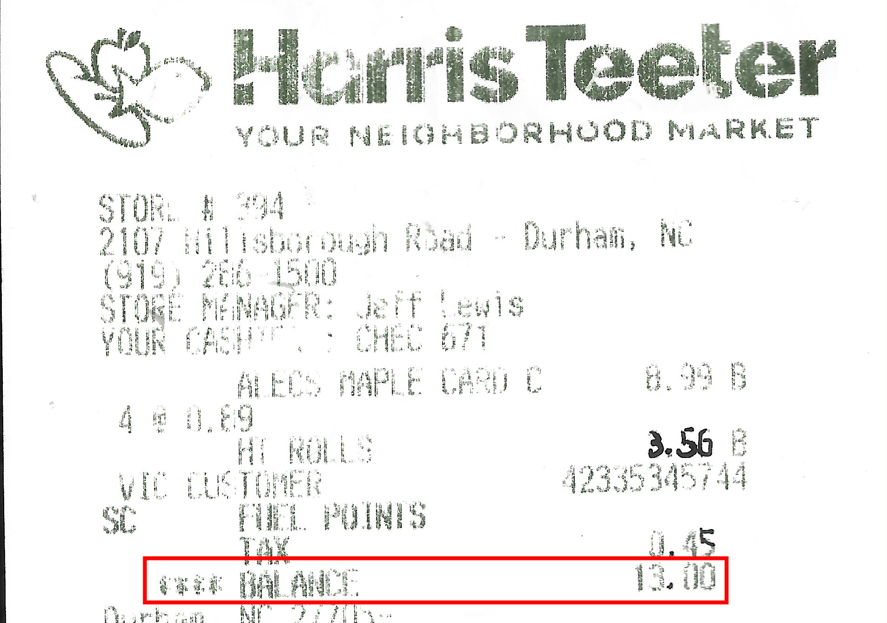

::: callout-important
## Under construction!
This assignment is not finalized. 
:::

## Problem 0

Recommend some music for us to listen to while we grade this.

## Problem X

One day last semester I looked down at my phone and saw this screen:

{fig-align="center" width="40%"}

Interpret the three probabilities and explain how they fit together.

## Problem X

Let $A$ and $B$ be events in a sample space $S$. Let $C$ be the set of outcomes that are in either $A$ or $B$, but *not* both.

a.  Draw a well-labeled picture of $S$, $A$, $B$, and $C$.

b.  Write down a formula for $C$ in terms of $A$ and $B$ using any of the basic operations: union ($\cup$), intersection ($\cap$), complement ($^c$).

c.  Use set theory and the probability axioms to show that

$$
P(C)=P(A)+P(B)-2P(A\cap B).
$$

d.  Explain this result conceptually (with words and pictures).

## Problem X

Let $S$ be a sample space, and consider events $A,\, B,\, C\subseteq S$. Recall that the law of inclusion/exclusion says that

$$
P(A\cup B)=P(A)+P(B)-P(A\cap B).
$$

a.  How should this be extended to unions of three events? $$
    P(A\cup B\cup C)=P(A)+P(B)+P(C) +\,...{???}
    $$ Explain your conjecture with words and pictures.

b.  Use set theory and the probabiity axioms to prove your conjecture in the previous part.

## Problem 9

A few months ago I went to Harris Teeter to get some junk food, and when I looked at my receipt, I saw this:

{width="50%" fig-align="center"}

I thought, "Strange. What are the odds the total would be a whole number?" Well, let's find out!

a. Imagine you randomly purchase two items that each cost less than $10, and assume all prices are equally likely. The prices of the two items are quoted to two decimal places. What is the probability that the two prices add up to a whole number total?
b. Now let's add a wrinkle. Imagine sales tax is 5%. This is calculated, rounded *up* to the nearest cent, and then added to your bill. What is the probability that the cost of the two items plus the rounded sales tax adds up to a whole number?

## Problem 10

Seven balls are randomly withdrawn from an urn that contains 12 red, 16 blue, and 18 green balls. Find the probability that

a.  3 red, 2 blue, and 2 green balls are withdrawn;
b.  at least 2 red balls are withdrawn;
c.  all withdrawn balls are the same color;
d.  either exactly 3 red balls or exactly 3 blue balls are withdrawn.

## Submission

You are free to compose your solutions for this problem set however you wish (scan or photograph written work, handwriting capture on a tablet device, LaTeX, Quarto, whatever) as long as the final product is a single PDF file. You must upload this to Gradescope and mark the pages associated with each problem.
