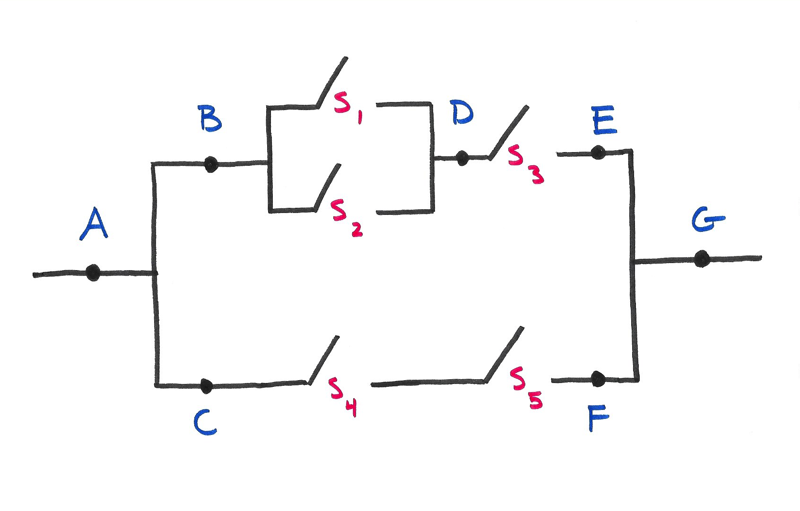

::: callout-important
## Under construction!
This assignment is not finalized. 
:::

## Problem 0

Recommend some music for us to listen to while we grade this.

## Problem X

We studied disease testing in class, and in our stylized example, a patient had only two attributes: their true disease status $D$ and their test result $T$. In reality of course, patients have many more relevant attributes: genetics, prior medical history, lifestyle, charm and good looks, etc. So in an attempt to be slightly more realistic, we shall extend our little model to include a third attribute: whether or not you have symptoms $S$. @tbl-disease enumerates all of the possible states of the world together with their individual probabilities.

| $D$ | $S$ | $T$ | $P(D\cap S\cap T)$ |
|------|------|------|------|
| -    | -    | -    | 0.32    |
| -    | -    | +    | 0.24    |
| -    | +    | -    | 0.16    |
| -    | +    | +    | 0.08    |
| +    | -    | -    | 0.02    |
| +    | -    | +    | 0.04    |
| +    | +    | -    | 0.06    |
| +    | +    | +    | 0.08    |

: {#tbl-disease tbl-colwidths="[25, 25, 25, 25]"}

a. What is the overall prevalence of this disease?

b. What is the sensitivity of the test?

c. Imagine you develop symptoms. So you visit Dr.\ Vinnie Boombatz to get tested, and the test comes back positive. Given everything we now know about you, what is the probability that you truly have the disease?

## Problem X

An encryption algorithm generates a seed value $z$ in the following way:

-   A binary operator is chosen at random from $\{+,\,\cdot\}$;

-   Two *distinct* numbers $x$ and $y$ are chosen at random from the set $\{1,\,2,\,...,\,9\}$ and the binary operation chosen above acts on $x$ and $y$ to produce $z$.

a.  What is the probability that $z$ is an even number?
b.  You notice that the algorithm generates an even $z$ value. Given this, what is the probability that the $+$ operator was used to generate it?

## Problem X

{fig-align="center" width="60%"}

The figure above displays a circuit. Switch $S_i$ closes with probability $p_i$, and the switches close independently of one another. What is the probability that electricity can flow from $A$ to $G$?

## Problem X

Two balls are chosen randomly from an urn containing 8 green, 4 black, and 2 orange balls. Suppose that we win \$2 for each black ball selected, we lose \$1 for each green ball selected, and we earn nothing for each orange ball selected. Let $X$ denote our winnings.

a.  Make a table with the possible values of $X$ and the probabilities of each value.

b.  Sketch the pmf of $X$.

c.  Sketch the cdf of $X$.

d.  Compute the expected value of $X$.

## Submission

You are free to compose your solutions for this problem set however you wish (scan or photograph written work, handwriting capture on a tablet device, LaTeX, Quarto, whatever) as long as the final product is a single PDF file. You must upload this to Gradescope and mark the pages associated with each problem.
