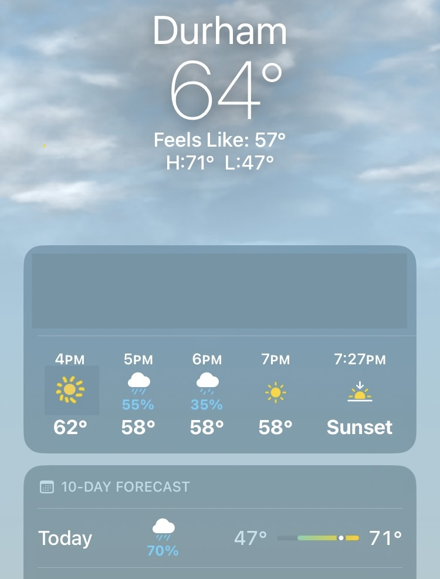

::: callout-important
## Under construction!
This assignment is not finalized. 
:::

## Problem 0

Recommend some music for us to listen to while we grade this.

## Problem X

One day last semester I looked down at my phone and saw this screen:

{fig-align="center" width="40%"}

Interpret the three probabilities and explain how they fit together.

## Submission

You are free to compose your solutions for this problem set however you wish (scan or photograph written work, handwriting capture on a tablet device, LaTeX, Quarto, whatever) as long as the final product is a single PDF file. You must upload this to Gradescope and mark the pages associated with each problem.
