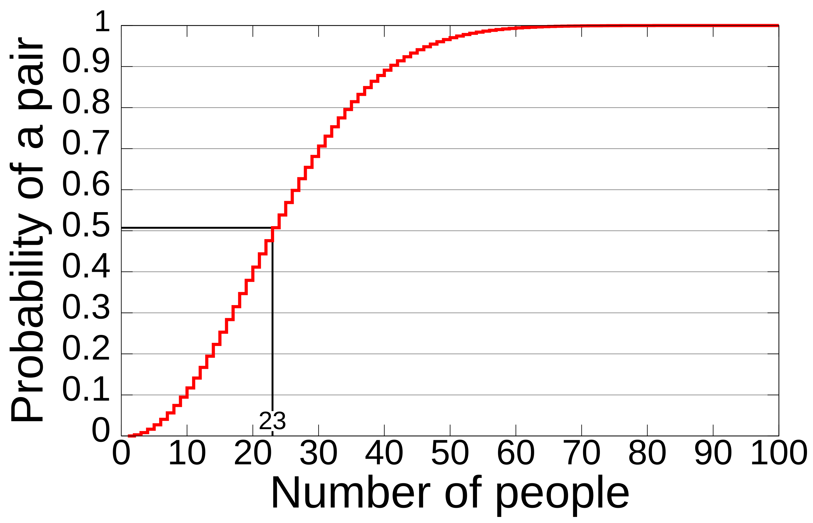
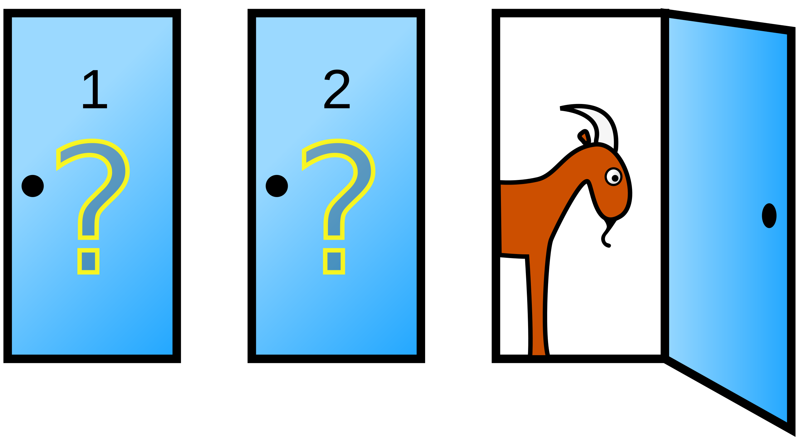
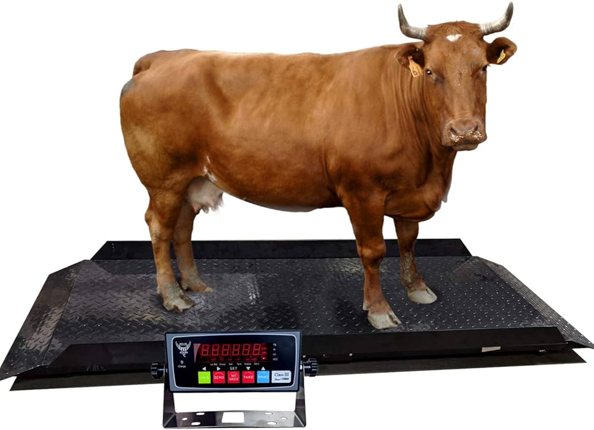
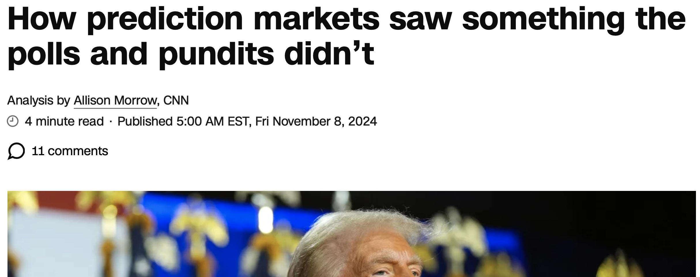
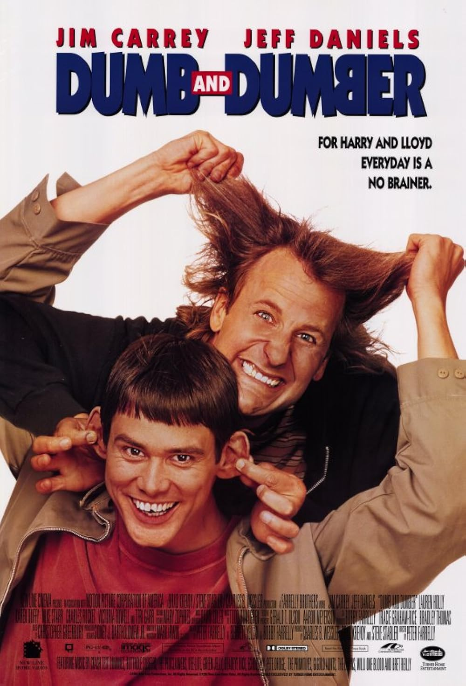
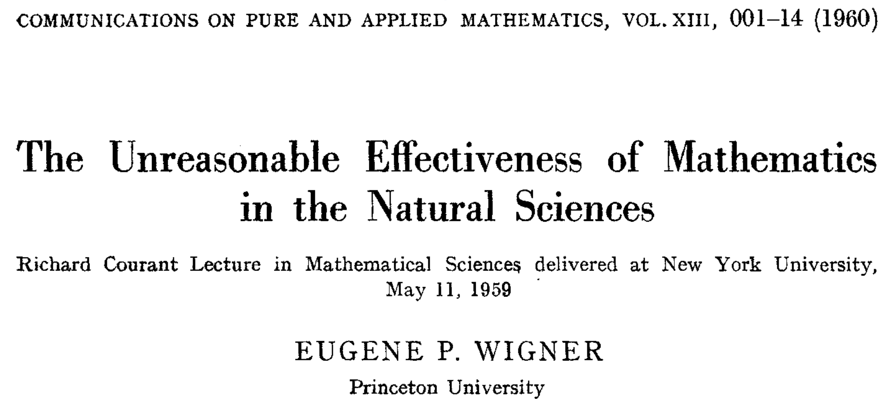
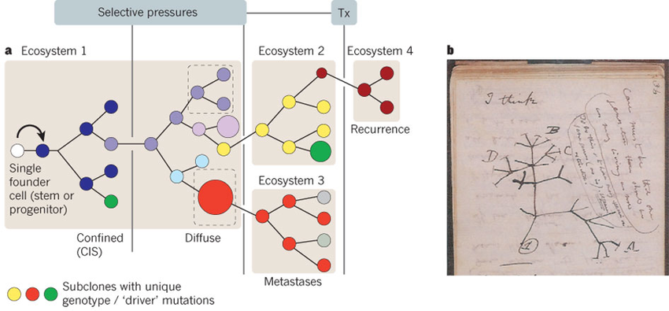
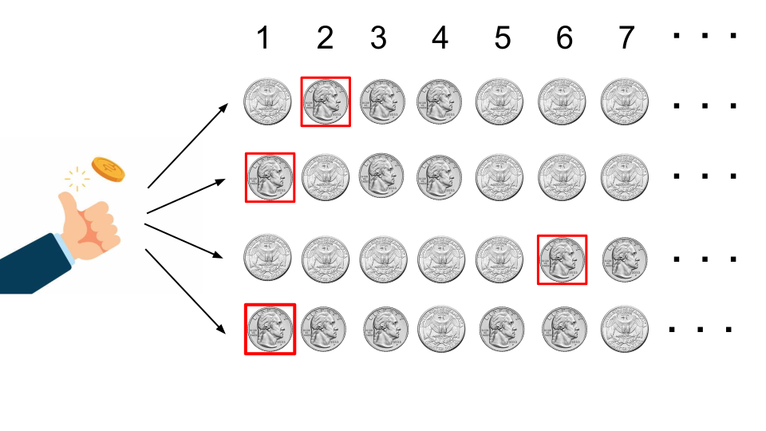
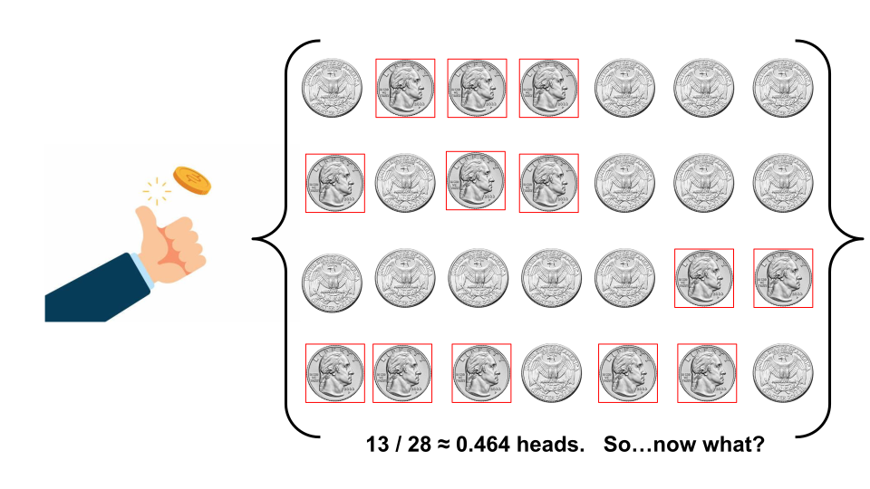
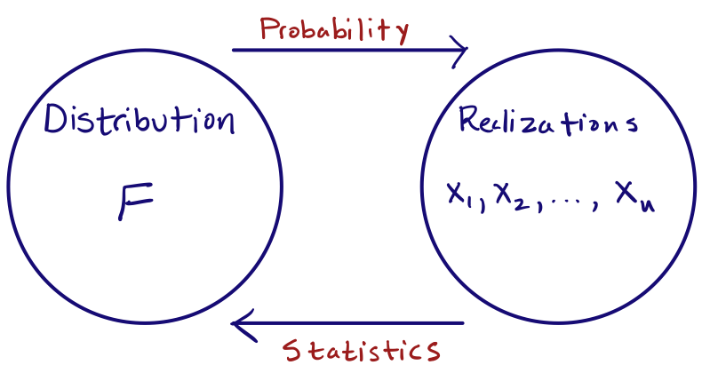

## Welcome to STA 240! {.large}

::::: {.columns .v-center-container}
::: {.column width="50%"}
While you wait, please complete this brief questionnaire:

*Update link!*
:::

::: {.column width="50%"}

:::
:::::

## Teaching Team {.medium}

| Mug                   | Name       | Role       | Office Hours  |
|-----------------------|------------|------------|---------------|
|                       |            | TA         | TBD           |
|                       |            | TA         | TBD           |
|                       |            | TA         | TBD           |
| {.c} | Zito, John | Instructor | Tue 3pm - 5pm |

# Why should you study the mathematics of probability and statistics?

# Reason 1: It's necessary.

## Example: the birthday problem

$k$ people convene for a birthday party:

-   What is the probability that *at least two* of the attendees share a birthday?

-   How many people need to show up to the party for there to be a 50% chance of at least one match?

Most people guess that you need a hundred or more people.

## Your guesses

LINK TO GOOGLE SHEET.

## Example: the birthday problem {.medium}

| no. of attendees (k) | Prob(at least one bday match) |
|----------------------|-------------------------------|
| 1                    | 0%                            |
| 4                    | 1.6%                          |
| 16                   | 28%                           |
| 23                   | 50.7%                         |
| 40                   | 89%                           |
| 56                   | 98%                           |
| 60                   | 99.4                          |
| $\vdots$             | $\vdots$                      |
| 366                  | 100.0%                        |

**Key words**: binomial coefficient, pigeonhole principle

## Example: the birthday problem

## Any matches today?

## Example: the Monty Hall problem

Let's play: <https://montyhall.io/>

{fig-align="center" width="50%"}

. . .

::: callout-note
## Very counterintuitive

Most people start out thinking that the two doors are equally likely to contain the prize, so switching doesn't matter. In fact, you have a 2/3 chance of winning if you switch.
:::

## You people

LINK TO GOOGLE SHEET.

## Example: the wisdom of crowds {.medium}

::::: columns
::: {.column width="30%"}

:::

::: {.column width="70%"}
At a 1906 country fair in Plymouth, 800 people participated in a contest to estimate the weight of an ox. Francis Galton observed that the median guess, 1207 lbs, was accurate within 1% of the true weight of 1198 lbs.
:::
:::::

. . .

::: callout-note
## Lesson

The aggregation of many imperfect estimates/guesses is often better than a needle-in-haystack search for the "best" individual guess.
:::

. . .

::: callout-warning
## Reality check!

It took humans a long time to realize this. The first recorded uses of an "average" were during Isaac Newton's lifetime (see Stigler's *Seven Pillars of Statistical Wisdom*).
:::

## Weight guessing results

LINK TO GOOGLE SHEET.

## Price guessing results

LINK TO GOOGLE SHEET. Reveal actual price.

## Price guessing results

LINK TO GOOGLE SHEET. Reveal actual price.

## Example: the wisdom of crowds

::: callout-warning
## [It's a lesson we are doomed to relearn often, apparently.](https://polymarket.com)

 (source: [CNN](https://www.cnn.com/2024/11/08/business/polymarket-election-trump-nightcap/index.html))
:::

## Example: the folly of doctors {.scrollable}

> A 50-year-old, asymptomatic woman tests positive for breast cancer. Alarming, but no diagnostic test is perfect. If the prevalence of breast cancer in the population is 1%, if the false negative rate of the test is 10%, and if the false positive rate is 9%, what is the chance that the woman *actually* has cancer, given that she tested positive?

. . .

You will know how to answer this by October. Doctors though...

. . .

::: callout-warning
## [BBC News 2014](https://www.bbc.com/news/magazine-28166019)

Only 34 out of 160 surveyed gynecologist got it right (9%). Almost half of them said 90%.

> We can only imagine how much anxiety those innumerate doctors instil in women.
:::

## Reason 1: It's necessary. {.large-ish}

::::: {.columns .v-center-container}
::: {.column width="35%"}
{width="90%"}
:::

::: {.column width="65%"}
Human intuition and “common sense” about probability and statistics are often just flat out wrong, in silly and dangerous ways. Mere mortals require the scaffolding of mathematics to discipline our thinking.
:::
:::::

# Reason 2: It's useful.

## New title: The Unreasonable Effectiveness of Probability in...Everything?

::: callout-note
## [Read it!](https://doi.org/10.1002/cpa.3160130102)

{fig-align="center" width="70%"}
:::

## Example: LLMs

::: callout-note
## Question

What method does ChatGPT use to generate the next word in one of its responses?
:::

. . .

[Let's ask!](https://chatgpt.com)

## Example: portfolio selection

::: callout-important
## Problem

How do you optimally allocate your savings to different assets (stocks vs bonds, Apple stock vs Microsoft, etc)?
:::

::: callout-note
## Objective

You want to make the most stable and lucrative choice possible, subject to uncertainty about how the competing assets will ultimately perform.
:::

::: callout-tip
## Thoroughly Modern Markowitz

The mathematics of this won a Nobel Prize in Economic Sciences in 1990, but it's "just" the creative application of basic probability.
:::

## Example: the mathematics of insurance

When an insurance company sells you a policy, they are making a bet that you won't need it -- that you'll pay them but they won't ultimately pay you. They make thousands of such bets, and if everyone makes a claim, the company is ruined. How do they navigate this uncertainty?

. . .

::: callout-note
## Actuarial mathematics!

Every insurance company employs armies of *actuaries*, certified professionals with a deep understanding of probability and statistics, to help them make decisions about profit, loss, and risk of ruin.
:::

## Example: mathematical biology

The metastasis of cancer cells is frequently modeled using something called a *branching process*, a kind of random evolution process that builds on the fundamentals of our course:

{fig-align="center"}

## Reason 2: It's useful {.large}

::::: {.columns .v-center-container}
::: {.column width="45%"}

:::

::: {.column width="55%"}
Learning probability theory gives you serious wings to study large swathes of science and technology.
:::
:::::

# Reason 3: It's beautiful.

## Good ol' Bert and Al

::: callout-tip
## Bertrand Russell, [*Mysticism and Logic and Other Essays*](https://en.wikisource.org/wiki/Mysticism_and_Logic_and_Other_Essays/Chapter_04) (1917)

Mathematics, rightly viewed, possesses not only truth, but supreme beauty cold and austere, like that of sculpture, without appeal to any part of our weaker nature, without the gorgeous trappings of painting or music, yet sublimely pure, and capable of a stern perfection such as only the greatest art can show.
:::

::: callout-tip
## Albert Einstein, ["The Late Emmy Noether"](https://www.nytimes.com/1935/05/04/archives/the-late-emmy-noether-professor-einstein-writes-in-appreciation-of.html?smid=url-share) (1935)

Pure mathematics is, in its way, the poetry of logical ideas.
:::

## This is a theorem we will prove:

{fig-align="center"}

## XXX

Cathedral!

## Reason 3: It's beautiful {.large}

::::: {.columns .v-center-container}
::: {.column width="50%"}
{width="70%"}
:::

::: {.column width="50%"}
Discerning elegant patterns within "random" behavior can be very aesthetically pleasing.
:::
:::::

## Why study mathematical probstat?

::: incremental
1.  It's necessary.

    -   Humans suck at thinking about this stuff.

2.  It's useful.

    -   It makes studying other things so much easier.

3.  It's beautiful.

    -   This is the main reason, honestly.
:::

. . .

Sound good?

# Syllabus highlights

## Bookmark the course page! {.large}

::::: {.columns .v-center-container}
::: {.column width="30%"}

:::

::: {.column width="70%"}
<https://sta240-f25.github.io/>
:::
:::::

## Final grade breakdown

Your final course grade will be calculated as follows:

| Category       | Percentage |
|----------------|------------|
| Labs           | 10%        |
| Problem Sets   | 30%        |
| Midterm Exam 1 | 20%        |
| Midterm Exam 2 | 20%        |
| Final exam     | 20%        |

::: callout-warning
The final letter grade will be based on the usual thresholds, which will not change and will be applied exactly. So no curve and no rounding.
:::

## So...where's the wiggle room?

-   We drop the two lowest labs;
-   We drop the lowest problem set;
-   We will replace your lowest midterm score with your final exam score (if it's better).

## Labs (10%)

Led by XXX in Perkins LINK 087 (Classroom 3):

-   Thursday 1:25 PM - 2:40 PM;
-   Thursday 3:05 PM - 4:20 PM.

Guided activities introducing you to special topics, extensions, applications, and case studies. We will also introduce some basic `R` stuff, and we will use Quarto for the lab write-ups.

::: callout-note
## Plan to attend regularly

Designed to be complete-able during the lab period, but due by 11:59 PM that same day.
:::

## Problem Sets (30%)

-   Mostly pencil-and-paper math problems, with some coding thrown in occasionally;
-   Compose solutions however you want: scan or photograph written work, handwriting capture, LaTeX, Quarto, whatever;
-   Submit a single PDF in Gradescope (and mark your pages!)

::: callout-warning
## Late policy

No late work will be accepted unless you request an extension in advance by e-mailing JZ. All reasonable requests will be entertained, but extensions will not be long.
:::

## Exams (20% each)

Traditional, in-class, written exams:

-   **Midterm 1**: Thursday October 9 *in your lab*;
-   **Midterm 2**: Thursday November 13 *in your lab*;
-   **Final Exam**: Friday December 12.

::: callout-note
## What can I use during the exam?

No resources except an 8.5" x 11" note sheet created by you and only you.
:::

::: callout-note
## If you need testing accommodations...

Make sure I get a letter, and make your appointments in the [Testing Center](https://testingcenter.duke.edu/) now.
:::

## Attendance

Not required. Live your life.

## Communication

If you wish to ask questions in writing...

-   **Post on Ed**: about general course policies and content;

-   **Email JZ directly**: personal matters.

You should not really be emailing the TAs directly for any reason.

## Collaboration

You are *enthusiastically encouraged* to work together on labs and problem sets. You will learn a lot from each other! Two policies:

- ✅ Acknowledge your collaborators: "Aloysius, Cybill, and I worked together on this problem;"
- ❌ Do not outright share or copy solutions. All submitted work must be your own.

Violation of the second policy is plagiarism. Sharers and recipients alike are referred to the conduct office and receive zeros.

## Use of outside resources, including AI

> [Using ChatGPT to complete assignments is like bringing a forklift into the weight room; you will never improve your cognitive fitness that way.](https://www.newyorker.com/culture/the-weekend-essay/why-ai-isnt-going-to-make-art)

- If you find a problem solution online (or prompt an LLM to generate one) and submit it as your own work, that will obviously be considered plagiarism;
- Otherwise, all outside resources are fair game for you to study and get extra practice;
- If you outsource all of your *thinking* to a language model, you will probably tank every exam. Good luck!

## What's the level of math here? {.scrollable}

This is essentially a pencil-and-paper math class. We will use all of the basic skills taught in Calc I and II:

::: incremental
-   differentiation (power rule, chain rule, all that)
-   integration (FTOC, improper integrals, substitution, by parts...)
-   limits and continuity (L'Hôpital's rule, etc)
-   infinite series (Taylor series for $e^x$, anyone?)
:::

. . .

**REVIEW**: [Problem Set 0](https://sta240-f25.github.io/psets/pset_0.html) is due 5PM Friday September 5.

. . .

::: callout-note
## This is not sink-or-swim.

Lab on Thursday August 28 is a review session and work period for this assignment.
:::

# So, what are we studying, anyway?

## Probability

::: {.v-center-container}

::: callout-tip
## What do we do?
State the *distribution* (rules) of some random phenomenon, and then study how the realizations of that phenomenon "typically" behave.
:::

:::

## A canonical probability problem

> Given a **fair** coin, how many flips will it take *on average* until you observe the first head?

. . .

## A canonical probability problem

> Given a **fair** coin, how many flips will it take *on average* until you observe the first head?

Why is this a probability problem?

::: incremental
1.  select a phenomenon to study (the outcome of a coin flip);
2.  fully specify its distribution (it's a fair, 50-50 coin);
3.  study typical behavior of realizations (how many flips *on average* until the first head?).
:::

## Statistics is "probability in reverse" 

::: {.v-center-container}

::: callout-tip
## What do we do?
Start with the realizations of a random phenomenon with *unknown* distribution, and try to use those realizations to figure out what the distribution is.
:::

:::

## A canonical statistics problem

> Given 28 flips from a mysterious coin, can you tell if it is fair?

. . .

## A canonical statistics problem

> Given 28 flips from a mysterious coin, can you tell if it is fair?

In probability, we *assumed* that the coin was fair, and then reasoned from that. In statistics, we do not do this. We start with some coin, which may or may not be fair, and then we try to "infer" its properties.

## Probability and statistics {.scrollable}

{fig-align="center" width="55%"}

. . .

+-----------------+---------------------------------------------+
| **Probability** | Forward problem\                            |
|                 | Deductive\                                  |
|                 | Reasons from rules to consequences          |
+-----------------+---------------------------------------------+
| **Statistics**  | Inverse problem\                            |
|                 | Inductive\                                  |
|                 | Observe consequences, and *infer* rules     |
+-----------------+---------------------------------------------+

## Forward problem versus inverse problem

::::: {.columns}
::: {.column width="50%"}

:::

::: {.column width="50%"}
- **Forward**: read the rulebook, and then play a game of chess;

- **Inverse**: watch a chess match, and based on the players' behavior, try to guess the rules.
:::
:::::

## Forward problem versus inverse problem

- *Differentiation* is a forward problem. You grab the function $F$, and you take the darn derivative;

- *Integration* is an inverse problem. Given the derivative, you have to figure out what the original function was:

$$
\text{FTOC:}\quad\int_a^bF'(x)\,\text{d} x=F(b)-F(a).
$$

## Inverse problems are tricky!

::::: {.columns}
::: {.column width="45%"}
**Forward**

> "Here's the question. What's the answer?"
:::

::: {.column width="50%"}
**Inverse**

> "If this is the answer, then what was the question?"
:::
:::::

::: callout-warning
## Gird your loins
Like all inverse problems, you will find that statistics is subtler, less well-defined, less straightforward, and more open-ended than probability.
:::

## The philosophy of probability {.scrollable}

. . .

Two common interpretive perspectives:

::: incremental
-   **Frequentist**: probability describes the long run frequency of repeatable events;
-   **Subjective**: probability describes an observer's subjective experience of uncertainty. Their "degrees of belief."
:::

. . .

::: callout-note
## You need both perspectives.

Like the wave-particle duality of light, both are true and useful, but their coexistence can be tense and uneasy. We just have to learn to live with that.
:::

. . .

::: callout-important
## The math doesn't care which you prefer.

Regardless your interpretation, the mathematics of probability is the same.
:::
