## About me

. . .

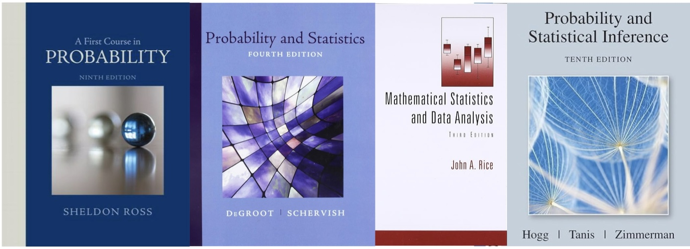{fig-align="center"}

::: incremental
- It's my sixth go-around teaching intro probability;
- I'm a tad weary of coins, dice, playing cards, etc.
:::

## Trying to mix it up

Plenty of applications from the natural and social sciences:

. . .

::::: {.columns}
::: {.column width="50%"}

- Actuarial mathematics;
- Contested elections;
- Expert witness testimony;
- *I Ching* divination;
- Investment risk and return;
- Language models;

:::

::: {.column width="50%"}

- (genetics)
- (?)
- (?)
- (?)
- (?)
- (?)

:::
:::::

. . .

*But what about the arts?*

## Stochastic music 

::::: {.columns}
::: {.column width="50%"}

AKA: chance or aleatoric music.

- leaving some aspect of the composition up in the air until the moment of performance;
- ⭐ simulating a random process to determine what notes to write down.

:::

::: {.column width="50%"}

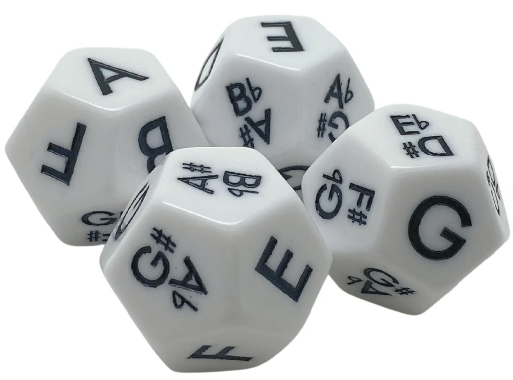

:::
:::::


## Iannis Xenakis (1922 - 2001)

::::: {.columns .v-center-container}
::: {.column width="50%"}


:::

::: {.column width="50%"}
- Studied both traditional western music and CS, statistical mechanics, stochastic processes, etc;
- Incorporated these ideas into his compositional process.
:::
:::::


## *Pithoprakta* (1956)

Think of each member of a 46-piece string orchestra as a Brownian particle drifting up and down the staff:

. . .

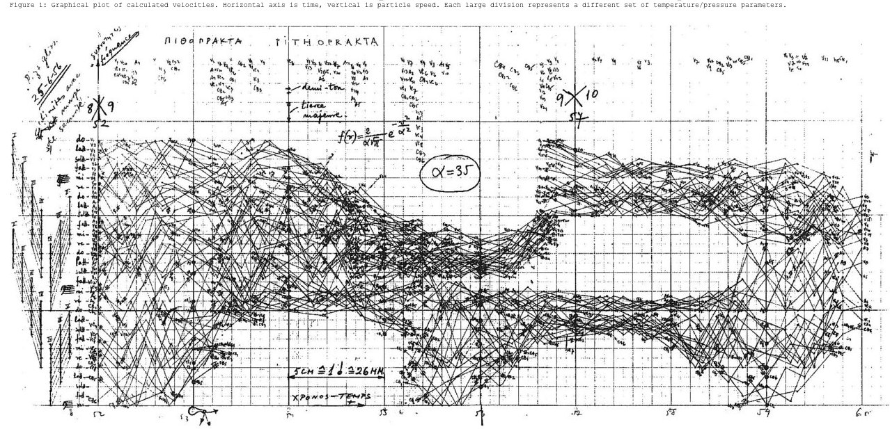{width="75%" fig-align="center"}

. . .

"[[E]very member of the orchestra is on the honor system](https://youtu.be/LfH74hlhKp0?feature=shared&t=639).” 
Leonard Bernstein

## *Pithoprakta* (1956)

<iframe width="900" height="500" src="https://www.youtube.com/embed/nvH2KYYJg-o?si=FCG2k2XsaY4MKZi-" title="YouTube video player" frameborder="0" allow="accelerometer; autoplay; clipboard-write; encrypted-media; gyroscope; picture-in-picture; web-share" referrerpolicy="strict-origin-when-cross-origin" allowfullscreen>

</iframe>

. . .

...it's the thought that counts.

## Main idea

::::: {.columns .v-center-container}
::: {.column width="100%"}


**Thought**: Can I prompt students to use what they know about probability distributions and simulation to write their own pieces of stochastic music?

**Worry**: Depends. Can you work with music in `R`?


:::
::::

## Renfei Mao's `gm` package

::::: {.columns .v-center-container}
::: {.column width="50%"}

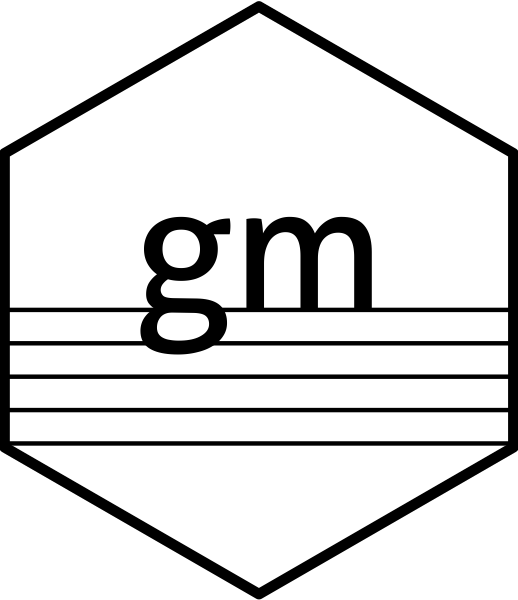

:::

::: {.column width="50%"}

"grammar of music"

- Represent music in `R` with a `ggplot2`-style interface;
- integration with `MuseScore` generates sheet music and MIDI playback.
:::
:::::

## Ravel: Prélude in A Minor, M. 65 {.scrollable}

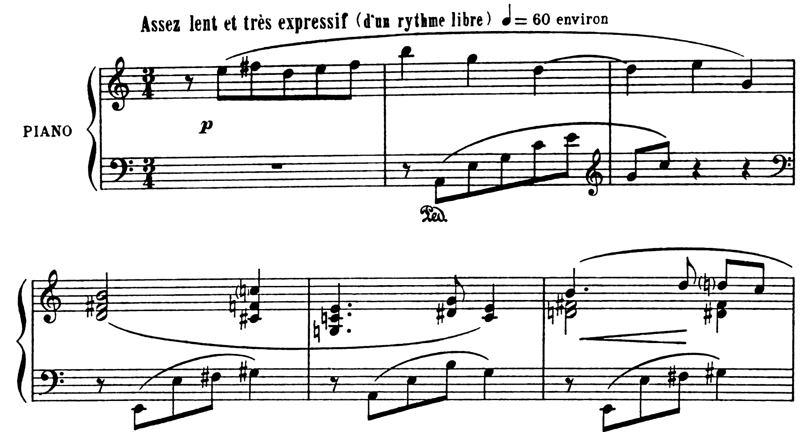

. . .

Let's transcribe it!

## The starting point is always the same

We will add layers to this:

```{r}
library(gm)

prelude <- Music()
```

. . .

Analogous to this:

```{r}
library(ggplot2)

myplot <- ggplot()
```

## Add meter and tempo

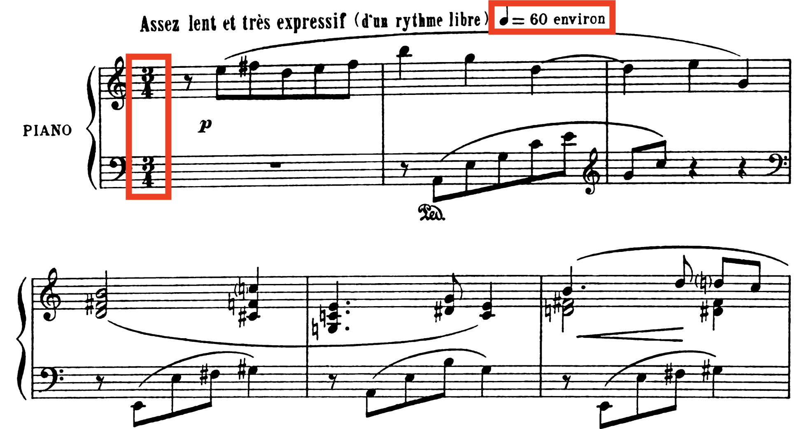

## Add meter and tempo

```{r}
prelude <- Music() + 
  Meter(3, 4) + 
  Tempo(60)
```

## Add the right hand part

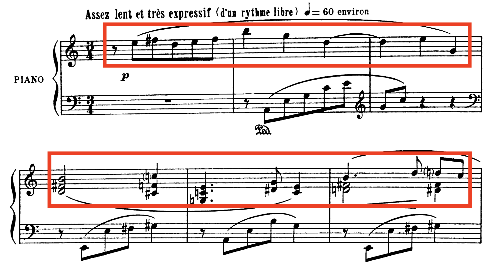

## Brief aside: scientific pitch notation

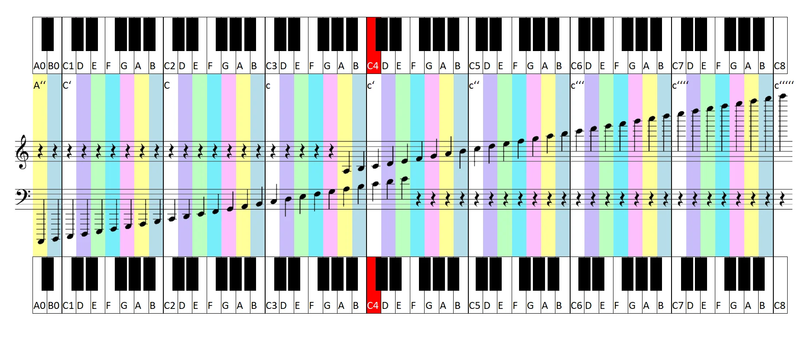{fig-align="center"}
`"F#5"` means the F♯ in the fifth octave on the piano, etc.

## Add the right hand part

```{r}
#| code-line-numbers: "1-7|1,7|2-6|12"
right_hand <- Line(
  pitches = list(NA, "E5", "F#5", "D5", "E5", "F#5",
                 "B5", "G5", "D5", 
                 "E5", "G4",
                 c("D4", "F#4", "B4"), c("C#4", "F4", "C5"),
                 c("G3", "C4", "E4"), c("D#4", "G4"), c("C4", "E4"))
)

prelude <- Music() + 
  Meter(3, 4) + 
  Tempo(60) +
  right_hand
```

## Add the right hand part

```{r}
#| eval: true
show(prelude)
```

## Adjust the note values {.medium}

```{r}
#| code-line-numbers: "7-11"
right_hand <- Line(
  pitches = list(NA, "E5", "F#5", "D5", "E5", "F#5",
                 "B5", "G5", "D5", 
                 "E5", "G4",
                 c("D4", "F#4", "B4"), c("C#4", "F4", "C5"),
                 c("G3", "C4", "E4"), c("D#4", "G4"), c("C4", "E4")),
  durations = c(0.5, 0.5, 0.5, 0.5, 0.5, 0.5, 
                1, 1, 2, 
                1, 1, 
                2, 1, 
                1.5, 0.5, 1)
)

prelude <- Music() + 
  Meter(3, 4) + 
  Tempo(60) +
  right_hand
```

## Adjust the note values

```{r}
#| eval: true
show(prelude)
```

## Add the left hand part

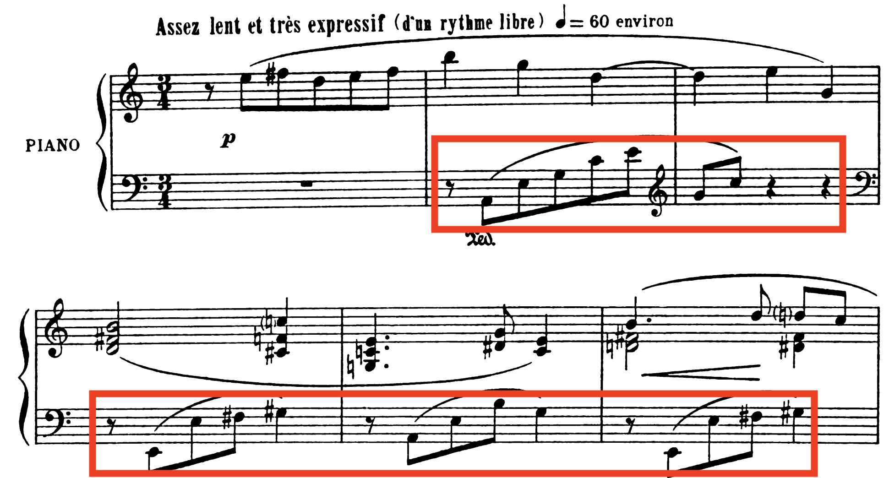

## Add the left hand part {.medium}

```{r}
#| code-line-numbers: "1-10|2-5|6-8|16-17"
left_hand <- Line(
  pitches = c("A2", "E3", "G3", "C4", "E4", 
              "G4", "C5", NA, 
              NA, "E2", "E3", "F#3", "G#3",
              NA, "A2", "E3", "B3", "G3"),
  durations = c(rep(0.5, 7), 2, 
                rep(0.5, 4), 1, 
                rep(0.5, 4), 1),
  bar = 2, offset = 0.5
)

prelude <- Music() + 
  Meter(3, 4) + 
  Tempo(60) +
  right_hand + 
  left_hand + 
  Clef("F")
```

**Note**: rests correspond to missing values (`NA`) in the line.

## Add the left hand part

```{r}
#| eval: true
show(prelude)
```

## Add dynamics

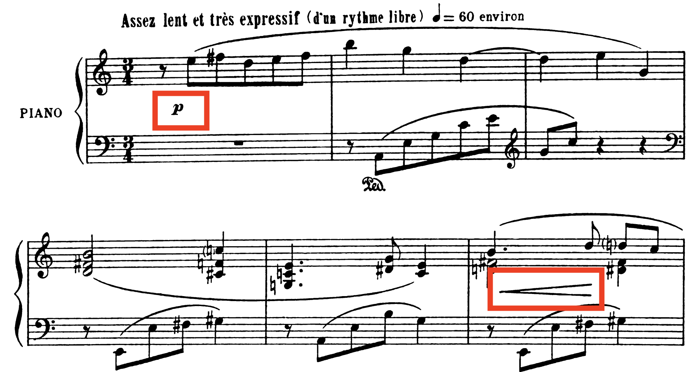

## Add dynamics

```{r}
#| code-line-numbers: "5,8"
prelude <- Music() + 
  Meter(3, 4) + 
  Tempo(60) +
  right_hand + 
  Dynamic("p", 1) + 
  left_hand + 
  Clef("F") +
  Dynamic("p", 1)
```

## Add expressive indications

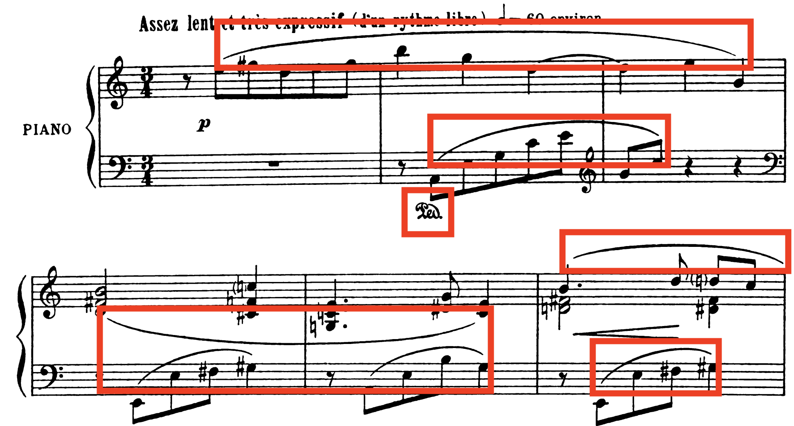

## Add expressive indications

```{r}
#| code-line-numbers: "6-7,11-14"
prelude <- Music() + 
  Meter(3, 4) + 
  Tempo(60) +
  right_hand + 
  Dynamic("p", 1) + 
  Slur(2, 11) + 
  Slur(12, 16) + 
  left_hand + 
  Clef("F") +
  Dynamic("p", 1) + 
  Slur(1, 7) + 
  Slur(10, 13) + 
  Slur(15, 18) + 
  Pedal(1, 7)
```

## Pretty close!

```{r}
#| eval: true
show(prelude)
```

## Change the instrumentation (optional)

```{r}
#| code-line-numbers: "8,15"
prelude <- Music() + 
  Meter(3, 4) + 
  Tempo(65) + 
  right_hand + 
  Dynamic("p", 1) + 
  Slur(2, 11) + 
  Slur(12, 16) + 
  Instrument(47) + # Harp!
  left_hand + 
  Clef("F") +
  Dynamic("p", 1) + 
  Slur(1, 7) + 
  Slur(10, 13) + 
  Slur(15, 18) + 
  Instrument(43) # Cello!
```

## Change the instrumentation (optional)

```{r}
#| eval: false
?Instrument
```

::::: {.columns}
::: {.column width="50%"}

1. Acoustic Grand Piano
1. Bright Acoustic Piano
1. Electric Grand Piano
1. Honky-Tonk Piano
1. Electric Piano 1
1. Electric Piano 2
1. Harpsichord
1. Clavinet

:::

::: {.column width="50%"}

9. Celesta
9. Glockenspiel
9. Music Box
9. Vibraphone
9. Marimba
9. Xylophone
9. Tubular Bells

... and so on

:::
:::::


## Change the instrumentation (optional)

```{r}
#| eval: true
show(prelude)
```

## Summary: the `gm` package

A `ggplot2`-style interface for music:

::::: {.columns}
::: {.column width="50%"}

```{r}
prelude <- Music() + 
  Meter(3, 4) + 
  Tempo(65) + 
  right_hand + 
  Dynamic("p", 1) + 
  Slur(2, 11) + 
  Slur(12, 16) + 
  Instrument(47) +
  left_hand + 
  Clef("F") +
  Dynamic("p", 1) + 
  Slur(1, 7) + 
  Slur(10, 13) + 
  Slur(15, 18) + 
  Instrument(43) 
```

:::

::: {.column width="50%"}

```{r}
show(prelude)
```


Thanks Renfei!

:::
:::::

# Now, some probability

## Every pitch on the piano {.medium}

```{r}
pitches <- c("C", "C#", "D", "D#", "E", "F", "F#", "G", "G#", "A", "A#", "B")
octaves <- 1:7
all_pitches <- c("A0", "A#0", "B0", 
                 paste(rep(pitches, length(octaves)), 
                       sort(rep(octaves, length(pitches))), 
                       sep = ""), 
                 "C8")
all_pitches
```

## The simplest piece of stochastic music

Sample the pitches with replacement:

```{r}
set.seed(8675309)

line1 <- Line(
  pitches = sample(all_pitches, 64, replace = TRUE),
  durations = .25
)

line2 <- Line(
  pitches = sample(all_pitches, 64, replace = TRUE),
  durations = .25
)

kitten <- Music() + 
  Meter(4, 4) + 
  Tempo(120) + 
  line1 + 
  line2 + 
  Dynamic("p", 1) +
  Dynamic("ffff", 64) +
  Hairpin("<", 2, 63)
```

## (Angry) Kitten on the keys {.scrollable}

```{r}
show(kitten)
```


## Markov

## The Jacobson method

::::: {.columns .v-center-container}
::: {.column width="50%"}


:::

::: {.column width="50%"}

Take an existing piece of music and "add noise." 

So this:

$$
\mathbf{y}=f(\mathbf{x})+\boldsymbol{\varepsilon},
$$

only...it's music?
:::
:::::

## Name that tune {.scrollable}

```{r}
#| echo: false
pitches_treble <- list(c("F4", "D4", "B3"), c("G4", "E4", "C4"), c("G4", "E4", "C4"), "C4", c("G4", "E4", "C4"), c("A4", "F4", "D4"), c("A4", "F4", "D4"), "C5", "B4", "A4", c("F4", "D4", "B3"), c("G4", "E4", "C4"), c("G4", "E4", "C4"), "C4", "C4", NA, NA, "C4", "C4", "D4", "E4", "F4", c("F4", "D4", "B3"), c("G4", "E4", "C4"), c("G4", "E4", "C4"), "C4", c("G4", "E4", "C4"), c("A4", "F4", "D4"), c("A4", "F4", "D4"), "C5", "B4", "A4", c("F4", "D4", "B3"), c("G4", "E4", "C4"), c("G4", "E4", "C4"), "C4", c("E4", "C4"), "F4", c("F4", "D4", "A3"), NA, "F4", "F4", "F4", NA, c("D4", "B3"), c("E4", "B3"), c("F4", "B3"), c("F4", "B3"), "G4", c("E4", "C4"), c("E4", "C4"), "D4", "C4", "C4", NA, NA, c("D4", "B3"), c("D4", "B3"), c("E4", "B3"), c("F4", "B3"), "E4", "C4", c("C5", "C4"), NA, "C5", "G4", NA, NA, c("D4", "B3"), c("D4", "B3"), c("E4", "B3"), c("F4", "B3"), "D4", c("F4", "B3"), "G4", NA, c("E4", "C4"), "D4", "C4", "C4", NA, NA, c("D4", "B3"), c("D4", "B3"), "F4", c("E4", "B3"), "D4", "C4", c("G4", "E4", "C4"), "G4", "G4", "A4", "G4", NA, c("F4", "D4", "B3"), "F4", "G4", "A4", "F4", c("G4", "E4", "C4"), "G4", "G4", "A4", "G4", "C4", NA, "D4", "E4", "F4", "D4", NA, c("G4", "E4", "C4"), "A4", "G4", "G4", "C4", "D4", "F4", "D4", c("A4", "F4", "D4"), c("A4", "F4", "D4"), c("A4", "F4", "D4"), c("G4", "E4", "C4"), c("G4", "E4", "C4"), "C4", "D4", "F4", "D4", c("G4", "E4", "C4"), c("G4", "E4", "C4"), c("G4", "E4", "C4"), c("F4", "D4", "A3"), c("F4", "D4", "A3"), "E4", "D4", "C4", "D4", "F4", "D4", c("F4", "D4", "B3"), "G4", c("E4", "C4"), c("E4", "C4"), "D4", "C4", "C4", c("G4", "C4", "A3"), c("F4", "D4", "A3"), "C4", "D4", "F4", "D4", c("A4", "F4", "D4"), c("A4", "F4", "D4"), c("A4", "F4", "D4"), c("G4", "E4", "C4"), c("G4", "E4", "C4"), "C4", "D4", "F4", "D4", c("C5", "C4"), "E4", "F4", "F4", "E4", "D4", "C4", "D4", "F4", "D4", c("F4", "D4", "B3"), "G4", c("E4", "C4"), c("E4", "C4"), "D4", "C4", "C4", c("G4", "C4", "A3"), c("F4", "D4", "A3"), NA)

times_treble <- list("quarter.", 0.5, 1, 1, "quarter.", 0.5, 1, 0.25, 0.25, 0.5, "quarter.", 0.5, 1, 1, "quarter.", 0.5, 0.5, 0.25, 0.25, 0.25, 0.5, 0.25, "quarter.", 0.5, 1, 1, "quarter.", 0.5, 1, 0.25, 0.25, 0.5, "quarter.", 0.5, 1, 1, 0.5, 0.5, 1, 1, 0.25, 0.5, 0.25, 1, 0.5, 0.5, 0.5, 0.5, 0.5, 0.5, 0.25, 0.25, 0.5, 2, 1, 0.5, 0.5, 0.5, 0.5, 0.5, 1, 0.5, 0.5, 0.5, 0.5, 2, 0.5, 0.5, 0.5, 0.5, 0.5, 0.5, 0.5, 0.5, 0.5, 0.5, 0.5, 0.5, 0.5, 1, 1, 0.5, 0.5, 0.5, 0.5, 0.5, 0.5, 1, 0.5, 0.5, 0.5, 0.5, 1, 1, 2, 0.5, 0.5, 0.5, 0.5, 0.5, 0.5, 0.5, 0.5, 1, 1, 2, 0.5, 0.5, 0.5, 0.5, 0.5, 0.5, 0.5, 0.5, 1, 0.25, 0.25, 0.25, 0.25, "eighth.", 0.25, 0.5, 0.5, 1, 0.25, 0.25, 0.25, 0.25, "eighth.", 0.25, 0.5, 0.5, 0.25, 0.25, 0.5, 0.25, 0.25, 0.25, 0.25, 1, 0.5, 0.5, 0.25, 0.25, 1, 0.5, 1, 2, 0.25, 0.25, 0.25, 0.25, "eighth.", 0.25, 0.5, 0.5, 1, 0.25, 0.25, 0.25, 0.25, 1, 0.5, 0.5, 0.25, 0.25, 0.5, 0.25, 0.25, 0.25, 0.25, 1, 0.5, 0.5, 0.25, 0.25, 1, 0.5, 1, 2, 1)

pitches_bass <- list("B1", c("B2", "B1"), "C2", "C2", c("C3", "C2"), "C2", c("C3", "C2"), "A1", c("A2", "A1"), "B1", "B1", c("D3", "B1"), "B1", c("D3", "B1"), "B1", c("B2", "B1"), "C2", "C2", c("C3", "C2"), "C2", c("C3", "C2"), "B1", c("B2", "B1"), "C2", "C2", c("C3", "C2"), "C2", c("C3", "C2"), "B1", c("B2", "B1"), "C2", "C2", c("C3", "C2"), "C2", c("C3", "C2"), "A1", c("A2", "A1"), "B1", "B1", c("D3", "B1"), "B1", c("D3", "B1"), "B1", c("B2", "B1"), "C2", "C2", c("C3", "C2"), "C2", c("C3", "C2"), "A1", c("A2", "A1"), "B1", "B1", c("D3", "B1"), "B1", c("D3", "B1"), "B1", c("F2", "B1"), c("B2", "B1"), c("B2", "B1"), c("C3", "C2"), c("C3", "C2"), c("C3", "C2"), c("C3", "C2"), c("B2", "B1"), "B1", c("F2", "B1"), c("B2", "B1"), c("B2", "B1"), c("C3", "C2"), NA, NA, NA, "B1", c("F2", "B1"), c("B2", "B1"), c("B2", "B1"), c("C3", "C2"), c("C3", "C2"), c("C3", "C2"), c("B2", "B1"), "B1", c("F2", "B1"), c("B2", "B1"), c("G2", "G1"), c("C3", "C2"), c("B2", "B1"), "B1", "B2", "B1", "B2", "B1", "B2", "B1", "B2", "B1", "B2", "B1", "B2", "B1", "B2", "B1", "B2", "B1", "B2", "B1", "B2", "B1", "B2", "B1", "B2", c("C3", "C2"), NA, NA, NA, c("B2", "B1"), c("B2", "B1"), c("B2", "B1"), c("C3", "C2"), c("C3", "C2"), NA, c("A2", "A1"), c("A2", "A1"), c("A2", "A1"), c("D3", "D2"), c("D3", "D2"), NA, c("G2", "G1"), c("C3", "C2"), c("C3", "C2"), "C3", c("E3", "A2"), c("D3", "D2"), NA, c("B2", "B1"), c("B2", "B1"), c("B2", "B1"), c("C3", "C2"), c("C3", "C2"), NA, c("A2", "A1"), c("A2", "A1"), c("D3", "D2"), c("D3", "D2"), NA, c("G2", "G1"), c("C3", "C2"), c("C3", "C2"), "C3", c("E3", "A2"), c("D3", "D2"), NA)

times_bass <- list(0.5, 1, 0.5, 0.5, 0.5, 0.5, 0.5, 0.5, 1, 0.5, 0.5, 0.5, 0.5, 0.5, 0.5, 1, 0.5, 0.5, 0.5, 0.5, 0.5, 0.5, 1, 0.5, 0.5, 0.5, 0.5, 0.5, 0.5, 1, 0.5, 0.5, 0.5, 0.5, 0.5, 0.5, 1, 0.5, 0.5, 0.5, 0.5, 0.5, 0.5, 1, 0.5, 0.5, 0.5, 0.5, 0.5, 0.5, 1, 0.5, 0.5, 0.5, 0.5, 0.5, 0.5, 0.5, 1, "quarter.", 0.5, "quarter.", 0.5, 1, 1, 0.5, 0.5, 2, 1, 0.5, 0.5, 1, 2, 0.5, 0.5, 2, 1, "quarter.", 0.5, 1, 1, 0.5, 0.5, 1, 2, "half.", 1, 0.5, 0.5, 0.5, 0.5, 0.5, 0.5, 0.5, 0.5, 0.5, 0.5, 0.5, 0.5, 0.5, 0.5, 0.5, 0.5, 0.5, 0.5, 0.5, 0.5, 0.5, 0.5, 0.5, 0.5, 0.5, 0.5, 1, 2, 0.75, 0.25, 0.5, 0.5, 1, 1, 0.75, 0.25, 0.5, 0.5, 1, 1, "quarter.", 0.5, 1, 1, 1, 2, 1, 0.75, 0.25, 0.5, 0.5, 1, 1, 1, 0.5, 0.5, 1, 1, "quarter.", 0.5, 1, 1, 1, 2, 1)

tie_starts_treble <- c(2, 6, 12, 14, 24, 28, 34, 36, 45, 46, 47, 50, 53, 57, 58, 59, 69, 70, 71, 79, 83, 95, 114)
tie_ends_treble <- tie_starts_treble + 1

random_shift <- function(start_pitch, notes = c("A", "B", "C", "D", "E", "F", "G"), var){
  shift <- round(rnorm(1, mean = 0, sd = sqrt(var)))
  start_note <- substring(start_pitch, 1, 1)
  start_octave <- strtoi(substring(start_pitch, 2, 2))
  n_length <- length(notes)
  
  old_pos <- which(notes == start_note)
  new_pos <- old_pos + shift
  while(new_pos > n_length){
    new_pos <- new_pos - n_length
  }
  while(new_pos < 1){
    new_pos <- new_pos + n_length
  }
  new_note <- notes[new_pos]
  
  new_octave <- start_octave
  if(shift > 0){
    if(new_pos >= 3 || shift >= n_length){
      new_octave <- min(new_octave + (shift %/% n_length), 7)
    }
  } else if(shift < 0){
    if(new_pos < 3 || (abs(shift) >= n_length && (shift %% n_length != 0))){
      new_octave <- max(new_octave - ((abs(shift) %/% n_length) + 1), 1)
    } else if(abs(shift) >= n_length && (shift %% n_length == 0)){
      new_octave <- max(new_octave - (abs(shift) %/% n_length), 1)
    }
  }
  return(paste0(new_note, new_octave))
}

find_lowest <- function(chord, notes = c("C", "D", "E", "F", "G", "A", "B")){
  if(length(chord) == 1){
    return(chord[1])
  }
  notes <- c()
  octaves <- c()
  
  for(pitch in chord){
    notes <- c(notes, substring(pitch, 1, 1))
    octaves <- c(octaves, strtoi(substring(pitch, 2, 2)))
  }
  
  pitch_cand <- notes[which.min(octaves)]
  min_cand <- pitch_cand[1]
  for(cand in pitch_cand){
    cand_ind <- which(cand == notes)
    min_ind <- which(min_cand == notes)
    if(cand_ind[1] < min_ind[1]){
      min_cand <- cand
    }
  }
  return(paste0(min_cand, min(octaves)))
}

set.seed(12345)
pitches_treble_rand3 <- pitches_treble

for(note in 1:43){
  # use N(0, 16)
  current_note <- pitches_treble[[note]]
  if(sum(is.na(current_note)) == 0){
    for(n in 1:length(current_note)){
      current_note[n] <- random_shift(start_pitch = current_note[n], var = 16)
    }
    pitches_treble_rand3[[note]] <- current_note
    if(note %in% tie_ends_treble){
      current_chord <- pitches_treble_rand3[[note]]
      current_low_ind <- which(current_chord == find_lowest(current_chord))
      prev_chord <- pitches_treble_rand3[[note - 1]]
      current_chord[current_low_ind] <- find_lowest(prev_chord)
      pitches_treble_rand3[[note]] <- current_chord
    }
  }
}

for(note in 44:115){
  # use N(0, 4)
  current_note <- pitches_treble[[note]]
  if(sum(is.na(current_note)) == 0){
    for(n in 1:length(current_note)){
      current_note[n] <- random_shift(start_pitch = current_note[n], var = 4)
    }
    pitches_treble_rand3[[note]] <- current_note
    if(note %in% tie_ends_treble){
      current_chord <- pitches_treble_rand3[[note]]
      current_low_ind <- which(current_chord == find_lowest(current_chord))
      prev_chord <- pitches_treble_rand3[[note - 1]]
      current_chord[current_low_ind] <- find_lowest(prev_chord)
      pitches_treble_rand3[[note]] <- current_chord
    }
  }
}

mystery_rand3 <- Music() + 
  Meter(4, 4) + 
  Line(pitches_treble_rand3, times_treble, name = "treble") + 
  Line(pitches_bass, times_bass, name = "bass") + 
  Clef("F", to = "bass") +
  Tie(2, to = "treble") + Tie(6, to = "treble") + Tie(12, to = "treble") + Tie(14, to = "treble") + Tie(24, to = "treble") + Tie(28, to = "treble") + Tie(34, to = "treble") + Tie(36, to = "treble") + Tie(45, to = "treble") + Tie(46, to = "treble") + Tie(47, to = "treble") + Tie(50, to = "treble") + Tie(53, to = "treble") + Tie(57, to = "treble") + Tie(58, to = "treble") + Tie(59, to = "treble") + Tie(69, to = "treble") + Tie(70, to = "treble") + Tie(71, to = "treble") + Tie(79, to = "treble") + Tie(83, to = "treble") + Tie(95, to = "treble") + Tie(114, to = "treble") + Tie(121, to = "treble") + Tie(123, to = "treble") + Tie(130, to = "treble") + Tie(132, to = "treble") + Tie(142, to = "treble") + Tie(154, to = "treble") + Tie(156, to = "treble") + Tie(164, to = "treble") + Tie(174, to = "treble") + 
  Tie(1, to = "bass") + Tie(3, to = "bass") + Tie(4, to = "bass") + Tie(5, to = "bass") + Tie(6, to = "bass") + Tie(8, to = "bass") + Tie(10, to = "bass") + Tie(11, to = "bass") + Tie(12, to = "bass") + Tie(13, to = "bass") + Tie(15, to = "bass") + Tie(17, to = "bass") + Tie(18, to = "bass") + Tie(19, to = "bass") + Tie(20, to = "bass") + Tie(22, to = "bass") + Tie(24, to = "bass") + Tie(25, to = "bass") + Tie(26, to = "bass") + Tie(27, to = "bass") + Tie(29, to = "bass") + Tie(31, to = "bass") + Tie(32, to = "bass") + Tie(33, to = "bass") + Tie(34, to = "bass") + Tie(36, to = "bass") + Tie(38, to = "bass") + Tie(39, to = "bass") + Tie(40, to = "bass") + Tie(41, to = "bass") + Tie(43, to = "bass") + Tie(45, to = "bass") + Tie(46, to = "bass") + Tie(47, to = "bass") + Tie(48, to = "bass") + Tie(50, to = "bass") + Tie(52, to = "bass") + Tie(53, to = "bass") + Tie(54, to = "bass") + Tie(55, to = "bass") + Tie(57, to = "bass") + Tie(58, to = "bass") + Tie(59, to = "bass") + Tie(61, to = "bass") + Tie(66, to = "bass") + Tie(67, to = "bass") + Tie(74, to = "bass") + Tie(75, to = "bass") + Tie(79, to = "bass") + Tie(82, to = "bass") + Tie(83, to = "bass") + Tie(117, to = "bass") + Tie(119, to = "bass") + Tie(123, to = "bass") + Tie(125, to = "bass") + Tie(129, to = "bass") + Tie(136, to = "bass") + Tie(138, to = "bass") + Tie(143, to = "bass") + Tie(147, to = "bass") +
  Tempo(114) + 
  Articulation(">", 63, to = "treble") + Articulation(".", 63, to = "treble") + Articulation(".", 120, to = "treble") + Articulation(".", 121, to = "treble") + Articulation(".", 129, to = "treble") + Articulation(".", 130, to = "treble") + Articulation(".", 153, to = "treble") + Articulation(".", 154, to = "treble") + 
  Articulation(">", 70, to = "bass") + Articulation(".", 70, to = "bass") + Articulation(">", 112, to = "bass") + Articulation(".", 112, to = "bass") + Articulation(".", 116, to = "bass") + Articulation(".", 117, to = "bass") + Articulation(".", 122, to = "bass") + Articulation(".", 123, to = "bass") + Articulation(".", 132, to = "bass") + Articulation(".", 135, to = "bass") + Articulation(".", 136, to = "bass") + Articulation(".", 150, to = "bass") +
  Accidental("sharp", 65, to = "bass") + Accidental("sharp", 81, to = "bass") + Accidental("sharp", 87, to = "bass") +
  Dynamic("mf", 1, to = "treble") + Dynamic("mf", 68, to = "treble") + Dynamic("f", 116, to = "treble")
```

```{r}
#| echo: false
#show(mystery_rand3)
```

## For the students

Explore the relationship between the probability rules governing the system and the sound of the resulting music.

play

surprise yourself


## Student Example 1

## Student Example 2

## Student Example 3

## Things I learned

- uses pitches outside the western system
- better inspo
- study Xenakis methods closer

## What I hope you take away

- creative 
- completely tilts the material on its ear
- if you have interests in the arts, you'll learn a ton and have lots of silly good fun

# Thank you!


